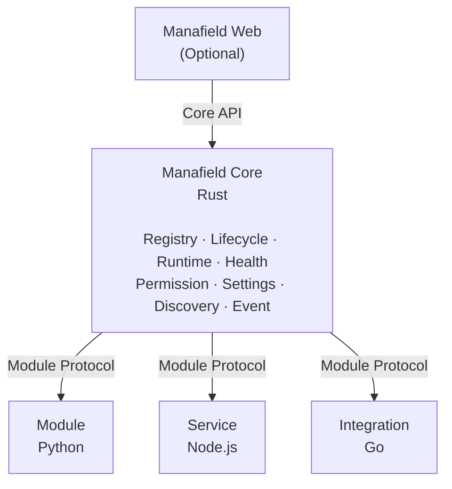
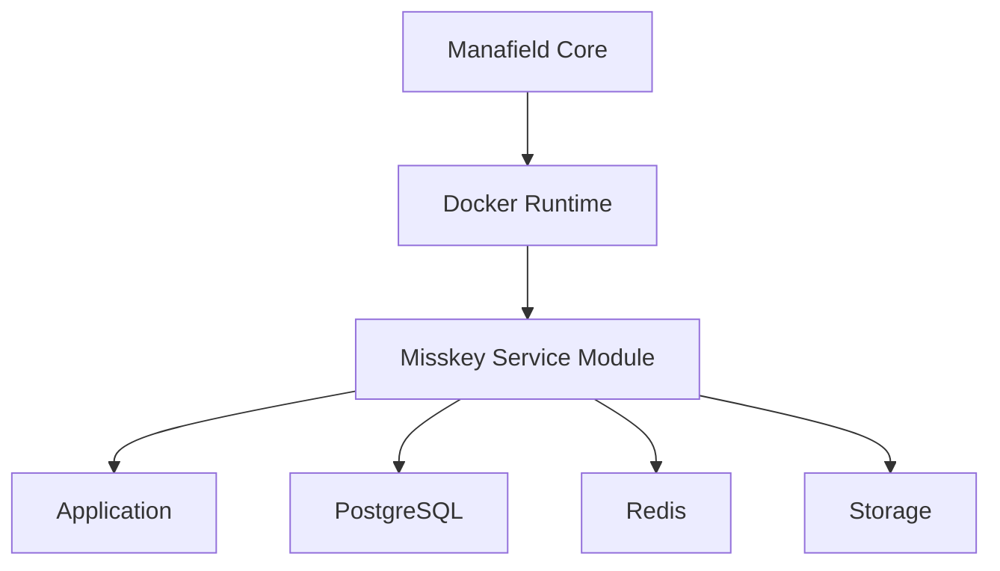

# Manafield

  <strong>A modular personal platform.</strong> 
  기록, 서비스, 도구와 외부 시스템을 하나의 환경으로 조립하는 개인용 모듈형 플랫폼입니다.

  

> [!IMPORTANT]
> **Pre-alpha / Design Stage**  
> Manafield는 현재 Core architecture와 Module Protocol을 설계하고 있는 초기 단계입니다.
>
> **한국어 문서를 기준 문서로 우선합니다.**  
> 한국어판과 영문판의 내용이 다를 경우 한국어판을 우선합니다.

[한국어](#한국어) · [English](#english)

---

# 한국어

**Manafield**는 여러 프로그램과 서비스를 하나의 방식으로 연결하고 관리하는 **개인용 모듈형 플랫폼**입니다.

핵심 원칙은 간단합니다.

> **Core는 엄격하게, Module은 자유롭게.**

Manafield Core는 **Rust**로 작고 엄격하게 만들고, Module은 Python, Go, Node.js, Java, Rust 등 **어떤 언어든 상관없이 API 계약만 지키면 연결**할 수 있는 구조를 목표로 합니다.

## 왜 만들고 있나요?

개인 홈페이지에 기능 하나를 추가할 때마다 전체 프로젝트를 뜯어고치는 대신,

- 필요한 기능만 골라 붙이고
- 독립 서비스도 같은 방식으로 관리하고
- Web UI가 없어도 동작하며
- 필요하면 Web, CLI, Mobile 같은 다른 View를 붙이고
- 장기적으로는 Module Package를 설치하는 것만으로 기능을 추가하는

그런 플랫폼을 직접 만드는 것이 목표입니다.

`manafield.studio`는 Manafield 자체가 아니라 **Eventide가 운영하는 하나의 Manafield 인스턴스**가 될 예정입니다.

## 개발 기준 버전

현재 Manafield Core 개발 기준 Rust toolchain은 **Rust 1.99.0**입니다.

- `rustc 1.99.0`
- `cargo 1.99.0`
- 루트의 `rust-toolchain.toml`로 개발 Toolchain을 고정합니다.

`rustup`을 사용하는 환경에서는 이 Repository 안에서 `cargo` 또는 `rustc`를 실행할 때 지정된 Rust 1.99.0 Toolchain이 자동으로 선택됩니다.

이 버전은 현재 개발 기준이며, 아직 공식적인 **MSRV(Minimum Supported Rust Version)** 를 의미하지는 않습니다.

## 목표 구조

- **Headless Core** — Web UI가 없어도 동작합니다.
- **Language-independent Modules** — 언어와 Framework에 종속되지 않습니다.
- **API-first Protocol** — Core와 Module은 API 계약으로 연결됩니다.
- **Docker Runtime** — 초기 실행 환경입니다.
- **Optional Web Views** — Module이 필요할 때만 Web UI를 제공합니다.
- **Isolated Modules** — Core 프로세스와 Module 실행환경을 분리합니다.
- **Runtime abstraction** — 먼 미래에는 Kubernetes도 연결할 수 있도록 설계합니다.

## 중간 목표

### Misskey를 Manafield Module로 얹기

Misskey처럼 자체 Web, DB, Cache, Storage와 Lifecycle을 가진 서비스를 Manafield가 설치하고 관리할 수 있다면, Module Host로서의 구조가 제대로 동작한다고 볼 수 있습니다.

## 문서

한국어 문서를 기준으로 유지하며, 영어 문서는 이를 바탕으로 동기화합니다.

- [Architecture](docs/kr/architecture.md)
- [Module Protocol](docs/kr/module-protocol.md)
- [Operation](docs/kr/operation.md)
- [Roadmap](docs/kr/roadmap.md)

## License

[Apache License 2.0](LICENSE)

수정·재배포할 때는 원본의 라이선스와 attribution을 유지하고, 수정된 파일에는 변경 사실을 명시해야 합니다. 자세한 내용은 [NOTICE](NOTICE)를 참고해 주세요.

---

# English

> **The Korean documentation is the primary source of truth.**  
> If the Korean and English versions differ, the Korean version takes precedence.

## What is Manafield?

**Manafield** is a modular personal platform for composing independent services, tools, modules, and integrations into one environment.

Its guiding principle is:

> **Strict Core, free Modules.**

The Core is planned to be implemented in **Rust**, while Modules may use any language or framework as long as they implement the Manafield Module Protocol.

## Development Toolchain

The current Manafield Core development baseline is **Rust 1.99.0**.

- `rustc 1.99.0`
- `cargo 1.99.0`
- The repository root contains `rust-toolchain.toml` to pin the development toolchain.

When using `rustup`, running `cargo` or `rustc` inside this repository automatically selects the pinned Rust 1.99.0 toolchain.

This is the current development baseline and does **not** yet define an official MSRV (Minimum Supported Rust Version).

## Highlights

- **Headless Core** — no mandatory Web UI
- **Language-independent Modules**
- **API-first Module Protocol**
- **Docker as the initial Runtime**
- **Optional Web Contributions**
- **Isolated Module execution**
- **Runtime abstraction** with Kubernetes as a long-term target

`manafield.studio` is not Manafield itself. It is planned to become **one Manafield instance operated by Eventide**.

## Intermediate Goal

A major milestone is to:

> **Run and manage Misskey as a Manafield Service Module.**

This will validate real-world lifecycle management involving an application runtime, database, cache, storage, networking, health checks, and a Web service.

## Documentation

- [Architecture](docs/en/architecture.md)
- [Module Protocol](docs/en/module-protocol.md)
- [Operation](docs/en/operation.md)
- [Roadmap](docs/en/roadmap.md)

## Status

**Pre-alpha / Design Stage**

The architecture and protocol are still evolving.

## License

[Apache License 2.0](LICENSE) · [NOTICE](NOTICE)
