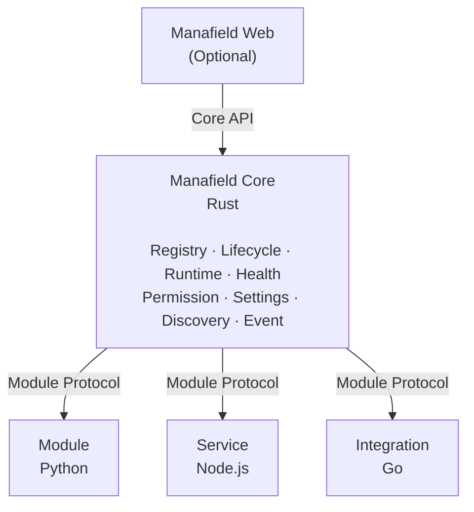
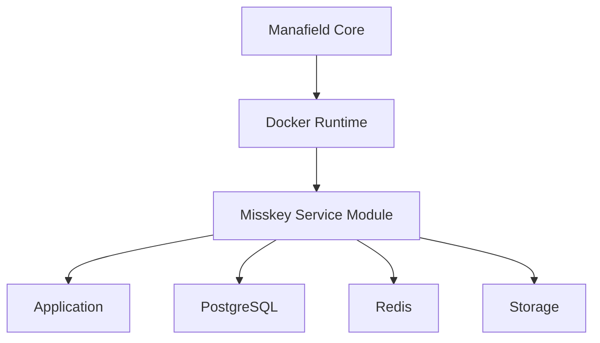

# Manafield

<p align="center">
  <strong>A modular personal platform.</strong><br/>
  기록, 서비스, 도구와 외부 시스템을 하나의 환경으로 조립하는 개인용 모듈형 플랫폼입니다.
</p>

<p align="center">
  <a href="https://buymeacoffee.com/manafield">
    
  </a>
</p>

> [!IMPORTANT]
> **Pre-alpha / Design Stage**  
> Manafield는 현재 Core architecture와 Module Protocol을 설계하고 있는 초기 단계입니다.
>
> **한국어 문서를 기준 문서로 우선합니다.**  
> 한국어판과 영문판의 내용이 다를 경우 한국어판을 우선합니다.

[한국어](#한국어) · [English](#english)

---

# 한국어

**Manafield**는 여러 프로그램과 서비스를 하나의 방식으로 연결하고 관리하는 **개인용 모듈형 플랫폼**입니다.

핵심 원칙은 간단합니다.

> **Core는 엄격하게, Module은 자유롭게.**

Manafield Core는 **Rust**로 작고 엄격하게 만들고, Module은 Python, Go, Node.js, Java, Rust 등 **어떤 언어든 상관없이 API 계약만 지키면 연결**할 수 있는 구조를 목표로 합니다.

Module이 외부에 제공하는 호출 가능한 기능은 **Operation**이라는 공통 계약으로 표현합니다. Operation은 기능 ID, optional description, Input/Output Schema, 호출 방식(Binding), Payload 형식(Codec)을 설명하며, Core는 이를 통해 Module의 구현 언어를 몰라도 어떤 기능을 어떻게 호출할 수 있는지 이해합니다.

Module 간 의존성과 Database/Cache/Storage 같은 기반 자원 요구는 모두 **Capability Contract**로 표현합니다. Fork나 대체 구현, Provider가 관리하는 Resource도 같은 versioned Capability matching에 참여할 수 있습니다.



## 왜 만들고 있나요?

개인 홈페이지에 기능 하나를 추가할 때마다 전체 프로젝트를 뜯어고치는 대신,

- 필요한 기능만 골라 붙이고
- 독립 서비스도 같은 방식으로 관리하고
- Web UI가 없어도 동작하며
- 필요하면 Web, CLI, Mobile 같은 다른 View를 붙이고
- 장기적으로는 Module Package를 설치하는 것만으로 기능을 추가하는

그런 플랫폼을 직접 만드는 것이 목표입니다.

`manafield.studio`는 Manafield 자체가 아니라 **Eventide가 운영하는 하나의 Manafield 인스턴스**가 될 예정입니다.

## 개발 기준 버전

현재 Manafield Core 개발 기준 Rust toolchain은 **Rust 1.99.0**입니다.

- `rustc 1.99.0`
- `cargo 1.99.0`
- 루트의 `rust-toolchain.toml`로 개발 Toolchain을 고정합니다.

`rustup`을 사용하는 환경에서는 이 Repository 안에서 `cargo` 또는 `rustc`를 실행할 때 지정된 Rust 1.99.0 Toolchain이 자동으로 선택됩니다.

이 버전은 현재 개발 기준이며, 아직 공식적인 **MSRV(Minimum Supported Rust Version)** 를 의미하지는 않습니다.

## 기본 CLI

Manafield binary는 Web 없이도 상태를 확인하고 Instance 작업을 수행할 수 있는 CLI를 함께 제공합니다.

```bash
manafield health
manafield ps
manafield resource
manafield resource manafield-postgres
manafield plan instance.yaml --output build-plan.json --ci-output ci-plan
manafield deploy /opt/manafield/instance/releases/123
```

`health`, `ps`, `resource` 같은 운영 command는 Core API를 사용합니다. 기본 API 주소는 `http://127.0.0.1:8080`이며, 필요하면 `MANAFIELD_CORE_URL`로 변경할 수 있습니다.

`plan`은 Instance Definition을 검증하고 Build Plan으로 해석합니다. `deploy RELEASE_DIR`은 이미 staging된 release에 대해 Docker Compose를 실행합니다. `build / verify / rebuild`와 release 준비 기능은 아직 Jenkins에서 CLI로 옮기는 중입니다. **현재는 CLI만으로 전체 Instance를 처음부터 구축할 수 없습니다.**

인자 없이 `manafield`를 실행하거나 `manafield serve`를 사용하면 Core server가 실행됩니다.

### v0 구축 기준

Manafield v0의 **전체 Instance 구축과 배포에는 Docker가 필요합니다.** Docker는 v0에서 의도적으로 채택한 deployment substrate이며, Jenkins는 필수 구성요소가 아닙니다.

향후에는 로컬에서도 `manafield` CLI + Docker만으로 동일한 Instance를 구축할 수 있어야 합니다. 현재 `deploy`에는 사전 준비된 release, Docker CLI, Compose plugin, Docker daemon 접근 권한이 필요합니다. Jenkins는 webhook, approval, credential integration, build history를 담당하면서 같은 CLI 경로를 호출하는 방향으로 발전합니다.

Core의 일반 Registry / Protocol 모델은 계속 Docker-specific privilege와 분리합니다. 자세한 결정은 [ADR-0013](docs/kr/adr/0013-docker-v0-cli-execution.md)을 참고합니다.

## 목표 구조

- **Headless Core** — Web UI가 없어도 동작합니다.
- **Language-independent Modules** — 언어와 Framework에 종속되지 않습니다.
- **API-first Protocol** — Core와 Module은 API 계약으로 연결됩니다.
- **Runtime Provider** — Module 실행 환경은 Core와 분리된 Provider가 담당합니다.
- **Capability-based dependencies** — Module identity와 기능 호환성 계약을 분리합니다.
- **Resource Providers** — PostgreSQL 같은 공용 기반 자원을 Module과 분리해 공급할 수 있도록 설계합니다.
- **Docker-required v0 deployment** — 전체 v0 Instance 구축/배포는 Docker를 요구하되 Core의 일반 모델과 Docker-specific privilege는 분리합니다.
- **Optional Web Views** — Module이 필요할 때만 Web UI를 제공합니다.
- **Isolated Modules** — Core 프로세스와 Module 실행환경을 분리합니다.
- **Privilege boundary** — Docker 같은 강한 권한은 Core가 아니라 별도 Runtime Provider 프로세스에 둡니다.
- **Runtime abstraction** — 장기적으로 Process, Remote, Kubernetes 같은 다른 Provider를 추가할 수 있도록 설계합니다.

## 중간 목표

### Misskey를 Manafield Module로 얹기

Misskey처럼 자체 Web, DB, Cache, Storage와 Lifecycle을 가진 서비스를 Manafield가 설치하고 관리할 수 있다면, Module Host로서의 구조가 제대로 동작한다고 볼 수 있습니다.



## 문서

한국어 문서를 기준으로 유지하며, 영어 문서는 이를 바탕으로 동기화합니다.

- [CLI / Docker v0 실행 가이드](docs/kr/cli.md)
- [Architecture](docs/kr/architecture.md)
- [Module Protocol](docs/kr/module-protocol.md)
- [Operation](docs/kr/operation.md)
- [Capability Contract](docs/kr/capability.md)
- [Web Surface](docs/kr/web-surface.md)
- [Official Web Shell](docs/kr/web-shell.md)
- [Roadmap](docs/kr/roadmap.md)
- [Architecture Decision Records](docs/kr/adr/README.md)

## License

[Apache License 2.0](LICENSE)

수정·재배포할 때는 원본의 라이선스와 attribution을 유지하고, 수정된 파일에는 변경 사실을 명시해야 합니다. 자세한 내용은 [NOTICE](NOTICE)를 참고해 주세요.

---

# English

> **The Korean documentation is the primary source of truth.**  
> If the Korean and English versions differ, the Korean version takes precedence.

## What is Manafield?

**Manafield** is a modular personal platform for composing independent services, tools, modules, and integrations into one environment.

Its guiding principle is:

> **Strict Core, free Modules.**

The Core is planned to be implemented in **Rust**, while Modules may use any language or framework as long as they implement the Manafield Module Protocol.

Callable functionality exposed by a Module is described through a common **Operation** contract. An Operation describes its ID, optional description, Input/Output Schema, invocation Binding, and Payload Codec so Core can understand what a Module provides without knowing its implementation language.

Dependencies and infrastructure needs such as databases, caches, and storage are all expressed through **Capability Contracts**. Compatible forks, alternate Module implementations, and Provider-managed Resources can participate in the same versioned matching model.

## Development Toolchain

The current Manafield Core development baseline is **Rust 1.99.0**.

- `rustc 1.99.0`
- `cargo 1.99.0`
- The repository root contains `rust-toolchain.toml` to pin the development toolchain.

When using `rustup`, running `cargo` or `rustc` inside this repository automatically selects the pinned Rust 1.99.0 toolchain.

This is the current development baseline and does **not** yet define an official MSRV (Minimum Supported Rust Version).

## Built-in CLI

The Manafield binary includes a headless CLI for inspecting a running Core and performing Instance work.

```bash
manafield health
manafield ps
manafield resource
manafield resource manafield-postgres
manafield plan instance.yaml --output build-plan.json --ci-output ci-plan
manafield deploy /opt/manafield/instance/releases/123
```

Operational commands such as `health`, `ps`, and `resource` use the Core API. The default API address is `http://127.0.0.1:8080` and may be overridden with `MANAFIELD_CORE_URL`.

`plan` resolves an Instance Definition locally. `deploy RELEASE_DIR` runs Docker Compose for a previously staged release. Build, verify, rebuild, and release staging are still migrating; **a full CLI-only from-scratch Instance build is not yet implemented.**

Running `manafield` without arguments, or using `manafield serve`, starts the Core server.

### v0 Deployment Baseline

A **full Manafield v0 Instance build and deployment requires Docker**. Docker is an intentional v0 deployment substrate; Jenkins is not required.

The local target is CLI + Docker. The current `deploy` command requires a pre-staged release, Docker CLI, Compose plugin, and access to the Docker daemon. Jenkins provides remote CI/CD concerns such as webhooks, approvals, credential integration, and build history while invoking the same CLI path.

The general Core registry/protocol model remains separated from Docker-specific privilege. See [ADR-0013](docs/en/adr/0013-docker-v0-cli-execution.md).

## Highlights

- **Headless Core** — no mandatory Web UI
- **Language-independent Modules**
- **API-first Module Protocol**
- **Runtime Providers** separated from Core
- **Capability-based dependencies** separated from concrete Module identity
- **Resource Providers** for shared infrastructure such as PostgreSQL
- **Docker-required v0 deployment**, while keeping Docker-specific privilege outside the general Core model
- **Optional Web Contributions**
- **Isolated Module execution**
- **Privilege boundaries** for powerful runtime control
- **Runtime abstraction** for future Process, Remote, and Kubernetes Providers

`manafield.studio` is not Manafield itself. It is planned to become **one Manafield instance operated by Eventide**.

## Intermediate Goal

A major milestone is to:

> **Run and manage Misskey as a Manafield Service Module.**

This will validate real-world lifecycle management involving an application runtime, database, cache, storage, networking, health checks, and a Web service.

## Documentation

- [CLI / Docker v0 execution guide](docs/en/cli.md)
- [Architecture](docs/en/architecture.md)
- [Module Protocol](docs/en/module-protocol.md)
- [Operation](docs/en/operation.md)
- [Capability Contract](docs/en/capability.md)
- [Web Surface](docs/en/web-surface.md)
- [Official Web Shell](docs/en/web-shell.md)
- [Roadmap](docs/en/roadmap.md)
- [Architecture Decision Records](docs/en/adr/README.md)

## Status

**Pre-alpha / Design Stage**

The architecture and protocol are still evolving.

## License

[Apache License 2.0](LICENSE) · [NOTICE](NOTICE)
