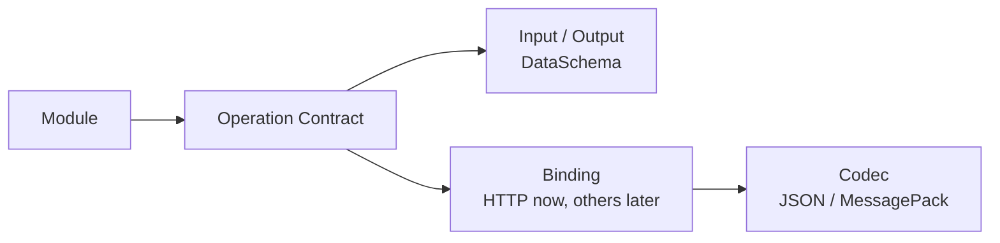
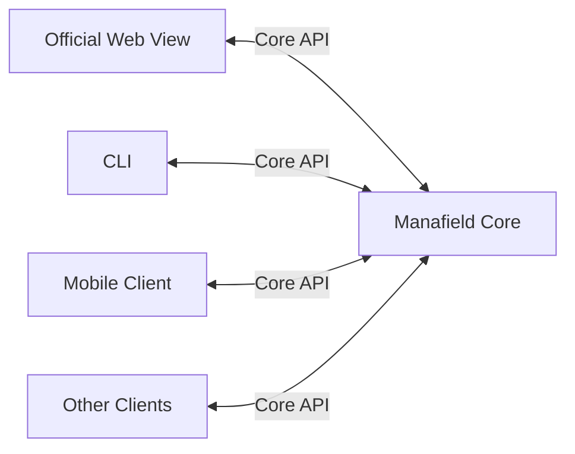
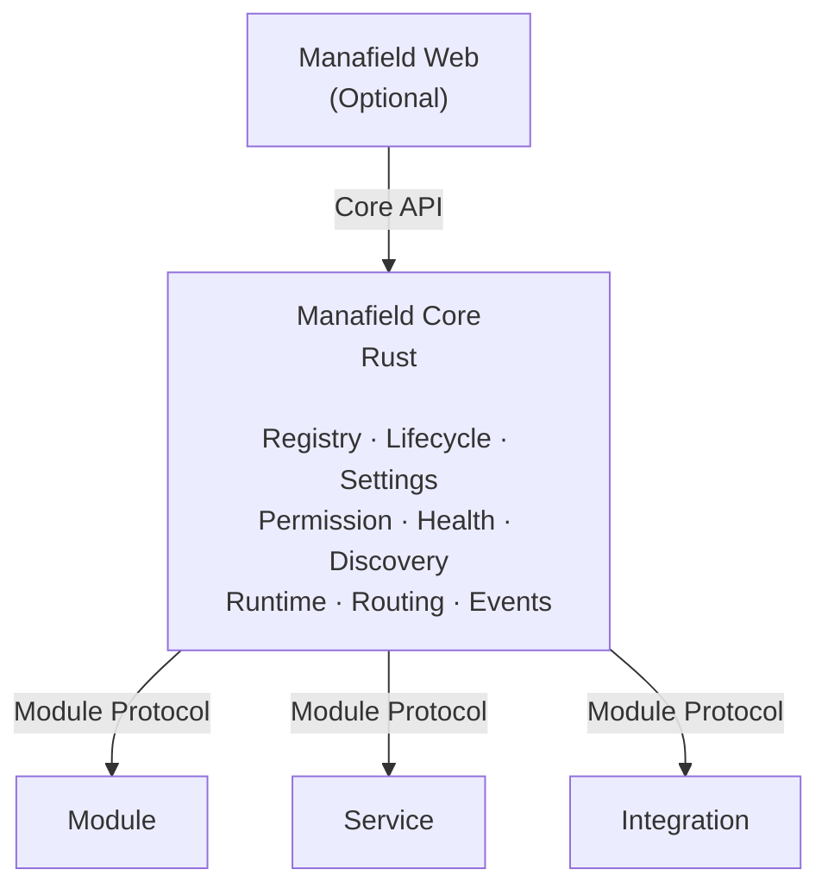
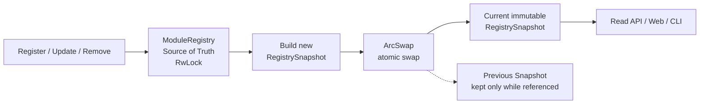
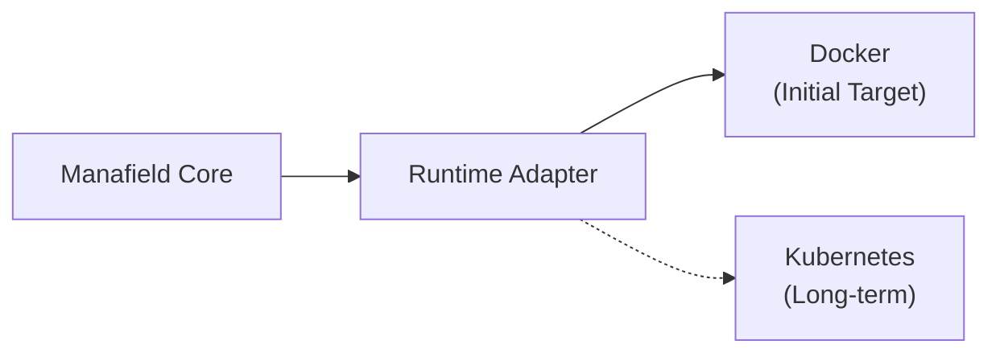
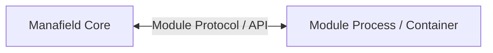

# Manafield Architecture

> This document describes the current architecture direction.  
> Manafield is still in the **pre-alpha / design stage**, so details may change.
>
> **The Korean documentation is the primary source of truth.**  
> If this English version differs from the Korean version, the Korean version takes precedence.

## 1. Project Definition

Manafield is a **modular personal platform**.

It is not a single website and it is not tied to a single UI.

The project aims to provide a small control plane capable of connecting and managing:

- modules
- independent services
- bots
- record systems
- external integrations
- optional Web interfaces

`manafield.studio` is an instance built on top of Manafield, not Manafield itself.

## 2. Development Baseline

The current Manafield Core development baseline is **Rust 1.99.0**.

```text
rustc 1.99.0
cargo 1.99.0
```

This is the current development and validation baseline. It does **not** yet define the project's official MSRV (Minimum Supported Rust Version).

A formal minimum supported Rust version may be defined later as the project stabilizes.

## 3. Core Philosophy

### Strict Core, Free Modules

The Core owns the parts that should remain consistent and predictable:

- Module Registry
- Manifest validation
- Module lifecycle
- Runtime abstraction
- Authentication and permissions
- Settings
- Health checks
- Service discovery
- Routing metadata
- Events and messaging

Modules are intentionally less constrained.

A Module may be implemented using Python, Go, Node.js, Java, Rust, or another environment capable of implementing the protocol.

### Role of Operations

In Manafield, an **Operation** is the common contract used to describe callable functionality exposed by a Module.

Core does not need to understand the Module's internal functions, classes, or implementation language. Instead, Operation Contracts in the Module Descriptor tell Core:

- which capabilities are available
- which Input / Output Schemas they use
- which Binding is used to invoke them
- which Codec is used for payloads

This keeps Module implementations free while giving Core and other clients one consistent model for discovery and validation.



See [Operation](operation.md) for the detailed model.

## 4. Headless Core

Manafield Core is designed to be headless.

The Core does not require a built-in Web UI to function.



An official Web View may be provided separately, but the Core and Modules should remain usable without it.

## 5. High-level Architecture



### Registry Read Model

The Module Registry separates the mutable write model from its read snapshot.

- `ModuleRegistry` is the source of truth for registration and mutation.
- Writes are serialized through an `RwLock`.
- After a successful mutation, Core builds a new immutable `RegistrySnapshot`.
- The current snapshot is atomically replaced through `ArcSwap`.
- Normal reads do not acquire the Registry `RwLock`; they read the current snapshot.
- Previous snapshots are automatically released through `Arc` reference counting once no readers still hold them.



Snapshot construction and swapping occur while the Registry write lock is still held so concurrent writers cannot publish snapshots out of order. Readers can continue using the previous snapshot while a new one is being built.

Future Registry events may feed audit logs, WebSocket notifications, metrics, and similar consumers, but the primary read snapshot should not depend on asynchronous event processing for consistency.

## 6. Component Types

### Module

Provides functionality directly to a Manafield instance.

Examples:

- Observe
- Records
- Dashboard

### Service

Represents an independently running service managed or connected by Manafield.

Examples:

- Echo
- Misskey

### Integration

Connects Manafield to an external system or platform.

Examples:

- ProtoDuck
- Discord
- external APIs

These categories describe execution characteristics and responsibility while sharing as much of the common Module Protocol as practical.

## 7. Runtime Model

Manafield does **not** implement a container runtime.

Instead, Core talks to runtime implementations through an adapter boundary.

The initial target and long-term runtime direction are:



Conceptually:

```rust
trait ModuleRuntime {
    async fn install(&self, module: &ModuleSpec) -> Result<()>;
    async fn start(&self, id: &ModuleId) -> Result<()>;
    async fn stop(&self, id: &ModuleId) -> Result<()>;
    async fn status(&self, id: &ModuleId) -> Result<ModuleStatus>;
    async fn remove(&self, id: &ModuleId) -> Result<()>;
}
```

The exact Rust API is not finalized.

## 8. Web Contributions

A Module does not need to provide a UI.

Initial Web contribution concepts:

### none

No Web UI.

### proxy

The Module runs its own Web application and Manafield exposes or routes it through an instance.

### external

The Module points to an external URL.

Future versions may experiment with more tightly integrated remote UI mechanisms, but they are intentionally outside the initial scope.

## 9. Isolation

The default architecture avoids loading arbitrary Module code directly into the Core process.



This makes language independence easier and provides a clearer security and failure boundary.

Third-party isolation may later include restricted containers or sandboxing.

## 10. Non-goals

Manafield does not aim to reimplement:

- Docker
- container isolation
- a database engine
- a reverse proxy
- Kubernetes

Manafield should orchestrate and compose existing technologies rather than replace them.
