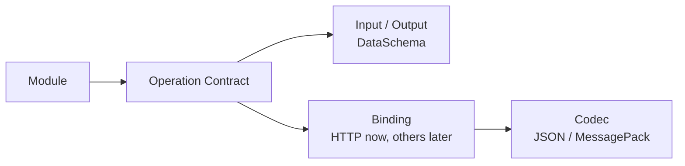
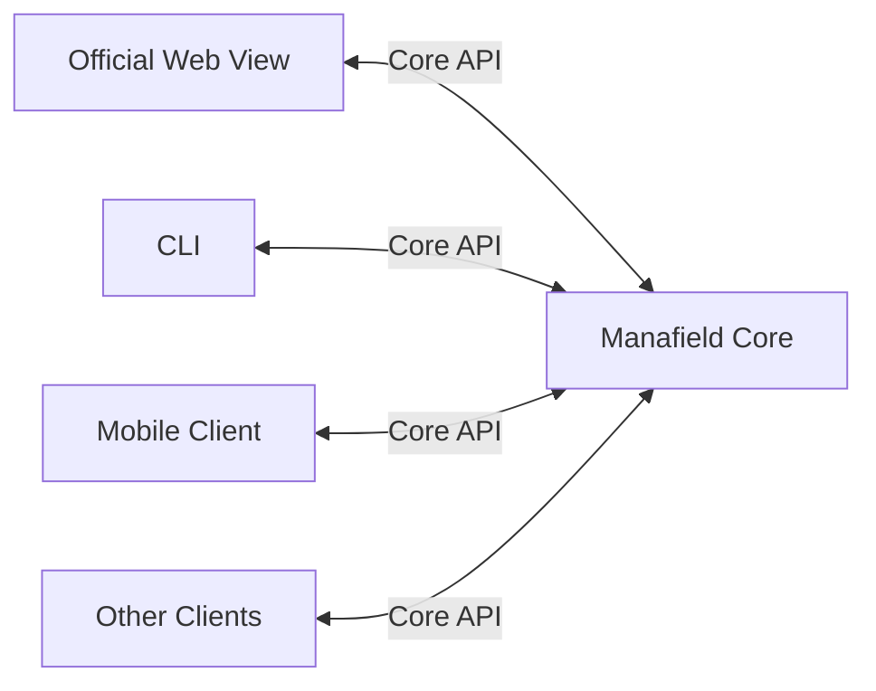
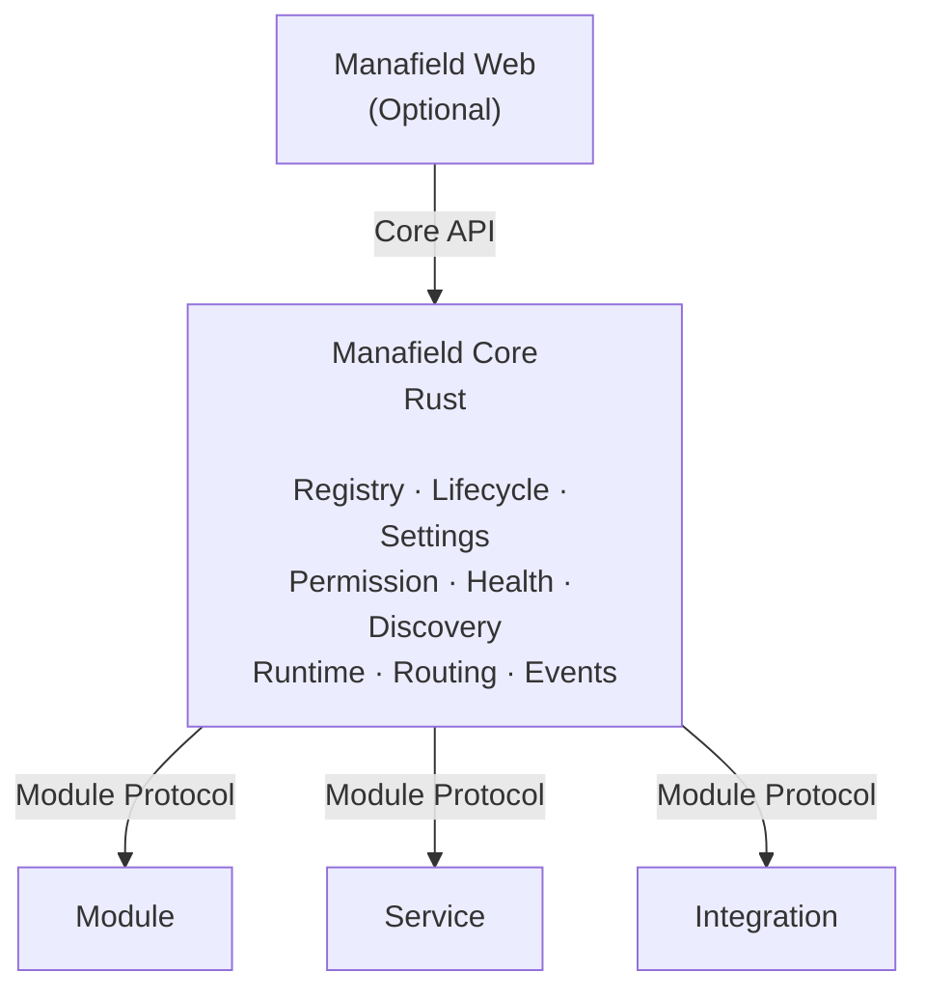
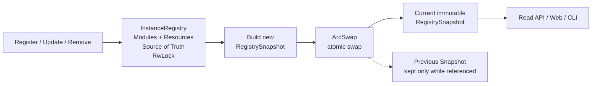
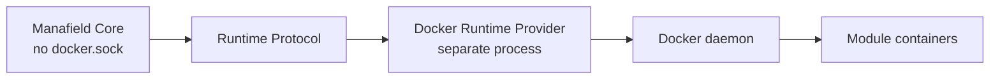
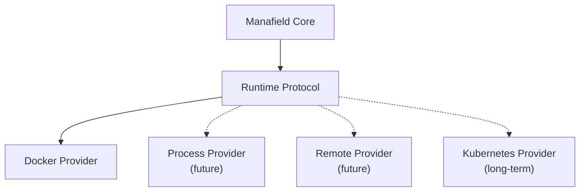

# Manafield Architecture

> This document describes the current architecture direction.  
> Manafield is still in the **pre-alpha / design stage**, so details may change.
>
> **The Korean documentation is the primary source of truth.**  
> If this English version differs from the Korean version, the Korean version takes precedence.

## 1. Project Definition

Manafield is a **modular personal platform**.

It is not a single website and it is not tied to a single UI.

The project aims to provide a small control plane capable of connecting and managing:

- modules
- independent services
- bots
- record systems
- external integrations
- optional Web interfaces

`manafield.studio` is an instance built on top of Manafield, not Manafield itself.

## 2. Development Baseline

The current Manafield Core development baseline is **Rust 1.99.0**.

```text
rustc 1.99.0
cargo 1.99.0
```

This is the current development and validation baseline. It does **not** yet define the project's official MSRV (Minimum Supported Rust Version).

A formal minimum supported Rust version may be defined later as the project stabilizes.

## 3. Core Philosophy

### Strict Core, Free Modules

The Core owns the parts that should remain consistent and predictable:

- Module Registry
- Manifest validation
- Module lifecycle
- Runtime abstraction
- Authentication and permissions
- Settings
- Health checks
- Service discovery
- Routing metadata
- Events and messaging

Modules are intentionally less constrained.

A Module may be implemented using Python, Go, Node.js, Java, Rust, or another environment capable of implementing the protocol.

### Boundary-first Development

Manafield defines **boundaries and responsibilities that would be expensive to extract later according to the long-term architecture, while implementing only the internal behavior currently needed**.

This does not mean implementing every future feature up front. It means explicitly establishing boundaries such as:

- Core and Module
- Operation and Binding / Codec
- Registry write model and read snapshot
- Core and Runtime Provider
- ordinary Modules and privileged system components
- Module identity and Capability Contracts
- the boundary that expresses ordinary requirements through Capability Contracts

Major architecture decisions and their rationale are recorded in [ADRs](adr/README.md).

### Role of Operations

In Manafield, an **Operation** is the common contract used to describe callable functionality exposed by a Module.

Core does not need to understand the Module's internal functions, classes, or implementation language. Instead, Operation Contracts in the Module Descriptor tell Core:

- which callable Operations are available
- which Input / Output Schemas they use
- which Binding is used to invoke them
- which Codec is used for payloads

This keeps Module implementations free while giving Core and other clients one consistent model for discovery and validation.



See [Operation](operation.md) for the detailed model.

### Role of Capabilities and Dependencies

An Operation represents one callable piece of functionality, while Module dependencies should not normally be pinned directly to a concrete implementation ID or route name.

Manafield separates **Capability Contracts** from Module identity.

```text
Module ID
→ concrete implementation identity

Operation
→ one callable contract

Capability
→ compatibility contract shared by interchangeable implementations

Tag
→ descriptive / non-binding metadata for search and classification
```

The compatibility matching surface of a Capability is intentionally small: `id + version`. Descriptions and tags support search/management UI and do not participate in matching.

Module Instances and Resource Instances may advertise Capability metadata in the same registry model. Manafield does not require them to implement one shared language-level `CapabilityProvider` interface.

For example, Echo may require `manafield.identity ^1` instead of a concrete `manafield-account` Module, and may require `database.postgresql ^1` through the same `requires.capabilities` grammar.

Concrete selection is represented as an explicit Binding from a consumer Instance's Requirement slot to a target Instance ID.

```text
echo-prod.identity → identity-core
echo-prod.state    → main-postgres
```

Module/Resource Instance IDs are unique within one Manafield Instance; duplicate registration is rejected as a conflict.

An unbound Requirement remains UNBOUND regardless of how many compatible candidates exist. Capability Discovery may expose compatible, advanced same-name, and full listing modes, but never creates a Binding automatically.

If a bound target provides the same Capability ID with a version outside the requested range, Core emits a `CAPABILITY_VERSION_MISMATCH` warning and diagnostic log but does not hard-block execution solely for that mismatch.

Endpoints, concrete config values, connection metadata, and secret references belong to concrete Instances or Instance configuration, while config schemas belong to Module/Resource Definitions. They are not part of Capability Contracts.

A system-side component may prepare, register, or manage Resources, but the Capability binding target is the concrete Resource Instance rather than the management component. Application data traffic also remains outside Core.

See [Capability Contract v0](capability.md) and [ADR-0010](adr/0010-capability-dependency-resolution.md) for the design.

## 4. Headless Core

Manafield Core is designed to be headless.

The Core does not require a built-in Web UI to function.



An official Web View may be provided separately, but the Core and Modules should remain usable without it.

The Manafield binary provides a CLI both as the default headless operational surface and as the Instance execution entrypoint.

```text
manafield health
manafield ps
manafield resource [id]
manafield plan [instance.yaml]
```

Operational commands such as `health`, `ps`, and `resource` remain Core API clients. `plan` resolves an Instance Definition; the implemented `deploy RELEASE_DIR` invokes Docker Compose for a staged release. Build, verify, rebuild, and staging are still being migrated, so a full CLI-only bootstrap is not yet supported.

A future contract may allow Modules to contribute CLI command metadata while preserving the rule that arbitrary Module code is not loaded into the Core process.

### Releases versus Runtime State (target)

**Platform building** produces Manafield Core, CLI, and official components; it does not rebuild independently published Modules. Instance Definitions describe Module/Resource Instances and Requirement Bindings.

`manafield use A` selects an editable private YAML copy of immutable A. `manafield module bind A B C` changes only consumer A's Requirement-slot-B target Instance C. `manafield deploy B` snapshots the working YAML when B is new or re-applies immutable B if it already exists.

Release IDs follow `vN_YYYYMMDDTHHMMSSZ` (UTC), stored at `<instance-root>/manafield/release/<id>.yaml`. PostgreSQL Resources and persistent data are reused across Releases. A full release-to-release diff engine is optional; safe desired-state reconciliation is not.

The target ships **separate CLI and Core server binaries in one distribution**. Existing combined-binary CLI commands are transitional. See [ADR-0014](adr/0014-instance-working-release.md) and the [CLI guide](cli.md).

## 5. High-level Architecture



### Registry Read Model

The Instance Registry separates the mutable write model from its read snapshot.

- `InstanceRegistry` is the source of truth for Module Instance and Resource Instance registration and mutation.
- Module and Resource Instance IDs share one unique namespace.
- Writes are serialized through an `RwLock`.
- After a successful mutation, Core builds a new immutable `RegistrySnapshot`.
- The current snapshot is atomically replaced through `ArcSwap`.
- Normal reads do not acquire the Registry `RwLock`; they read the current snapshot.
- Previous snapshots are automatically released through `Arc` reference counting once no readers still hold them.



Snapshot construction and swapping occur while the Registry write lock is still held so concurrent writers cannot publish snapshots out of order. Readers can continue using the previous snapshot while a new one is being built.

Future Registry events may feed audit logs, WebSocket notifications, metrics, and similar consumers, but the primary read snapshot should not depend on asynchronous event processing for consistency.

## 6. Component Types

### Module

Provides functionality directly to a Manafield instance.

Examples:

- Observe
- Records
- Dashboard

### Service

Represents an independently running service managed or connected by Manafield.

Examples:

- Echo
- Misskey

### Integration

Connects Manafield to an external system or platform.

Examples:

- ProtoDuck
- Discord
- external APIs

The Module / Service / Integration categories describe execution characteristics and responsibility while sharing as much of the common Module Protocol as practical.

### Provider

A Provider is not an ordinary Module. It is a **system-side component that connects Manafield to execution environments, infrastructure resources, or ingress functionality**.

Examples:

- Docker Runtime Provider
- PostgreSQL Resource Provider
- Traefik Ingress Provider / Adapter

Providers may require stronger privileges or host-infrastructure access than ordinary Modules, so they have separate boundaries.

## 7. Runtime Model

Manafield Core is not tied to a specific execution technology.

Actual Module creation, start, stop, removal, and runtime control are delegated to a **Runtime Provider**. A Runtime Provider is not an ordinary Module; it is a privileged system component that controls an execution environment.

Core must remain useful without a Runtime Provider for Registry, Operation discovery, validation, and similar base capabilities.

However, a **supported full Manafield v0 Instance build/deployment requires Docker**. This does not make Core itself Docker-dependent; it fixes Docker as the baseline v0 deployment runtime.

The canonical Instance execution entrypoint is the `manafield` CLI. Jenkins is treated as the first official remote CI/CD frontend that invokes that CLI. See [ADR-0013](adr/0013-docker-v0-cli-execution.md).



The initial Docker Provider is maintained in the **same repository / release** as Core but built and executed as a separate binary / process.

```text
same source / release
├─ manafield
└─ manafield-runtime-docker
```

In Docker deployment, Core does not receive `docker.sock`; only the Docker Runtime Provider does. This separates Docker-specific privilege and policy from general Core API and Registry logic.

Core and Provider communicate through a constrained **Runtime Protocol**. The protocol should express Manafield lifecycle operations rather than arbitrary Docker command execution.

For example:

```text
Create
Start
Stop
Remove
Status
```

Unix Domain Socket is the preferred initial local transport candidate. Future Runtime Providers may target local processes, remote hosts, Kubernetes, or other environments.



The detailed Runtime Protocol and capability model are still being designed. See [ADR-0004](adr/0004-runtime-provider-boundary.md) and [ADR-0005](adr/0005-docker-provider-isolation.md) for rationale.

### Provider Family

In addition to Runtime Providers, Manafield may use **Resource Providers** to prepare infrastructure resources.

For example:

```text
Provider
├─ Runtime Provider
│  └─ Docker
├─ Resource Provider
│  └─ PostgreSQL
└─ Ingress Provider / Adapter
   └─ Traefik
```

These share the broad property of adding system-side functionality without being ordinary Modules.

Runtime, Resource, and Ingress Providers may have very different privileges and lifecycles, so Manafield does not prematurely force them into one universal Provider Protocol. Each Provider family can receive its own protocol and security boundary when needed.

### Network Planes

Docker deployments separate internal Module communication from externally facing edge traffic.

```text
manafield-modules
→ internal Core ↔ Module communication

manafield-edge
→ shared edge network for Traefik / Cloudflared / externally exposed Modules
```

Core connects only to `manafield-modules` by default. Modules that need an external Web surface may additionally join `manafield-edge`.

`manafield-edge` is treated as an external Docker network owned by host infrastructure rather than by an individual Manafield Compose deployment. See [ADR-0008](adr/0008-network-planes.md) for rationale.

## 8. Web Contributions / Exposure

A Module does not need to provide a UI.

The fact that a Module provides a Web surface is separate from **where that surface is publicly exposed**. Concrete public exposure is selected by the private Instance Definition and an Ingress Provider.

The current Web Exposure model uses:

- `none` — no public Web exposure
- `host` — a dedicated hostname
- `prefix` — exposure under a path prefix
- `routes` — explicit root-level route claims
- `external` — an external URL outside Manafield

Public URLs are not derived automatically from Operation IDs or Binding paths.

See [ADR-0009](adr/0009-operation-web-exposure.md) for the decision.

### Official Web Shell

The official Web View is a separate `manafield-web` Module rather than UI embedded in Core.

An integrated Instance may compose multiple Module Web surfaces under one public origin through path routing.

```text
manafield.studio/           → manafield-web
manafield.studio/account/*  → Account Module
manafield.studio/echo/*     → Echo Module
```

`manafield-web` may own presentation responsibilities such as the home page, navigation, Registry discovery, and session-entry UX, but it is not the mandatory reverse proxy for all Module APIs. Ingress should route ordinary traffic directly to the owning Module where practical.

The first Official Web Shell implementation starts as a lightweight Go single-binary Web Module. Core and ordinary Modules remain functional without it, and ordinary Modules do not depend on the Shell.

Initial composition uses full-page/path surfaces; dynamic micro-frontend loading is deferred until there is a concrete need.

See [ADR-0011](adr/0011-official-web-shell.md) for the decision.

## 9. Isolation

The default architecture avoids loading arbitrary Module code directly into the Core process.


This makes language independence easier and provides a clearer security and failure boundary.

Third-party isolation may later include restricted containers or sandboxing.

## 10. Non-goals

Manafield does not aim to reimplement:

- Docker
- container isolation
- a database engine
- a reverse proxy
- Kubernetes

Manafield should orchestrate and compose existing technologies through explicit Module and Provider contracts rather than replace them.
