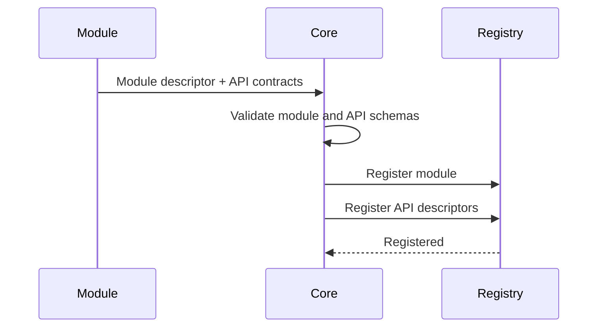

# Manafield Module Protocol

> Draft protocol notes. Nothing in this document is stable yet.
>
> **The Korean documentation is the primary source of truth.**  
> If this English version differs from the Korean version, the Korean version takes precedence.

## 1. Principle

Manafield Modules communicate with Core through a language-independent protocol.

> **The protocol is the contract.**

A Module should not need to import Manafield Core code or use a mandatory SDK.

Language-specific SDKs may exist for convenience, but they must remain optional.

## 2. Initial Transport

The initial protocol is expected to use HTTP for the basic control and discovery surface.

WebSocket or another message/event transport may be added when required.

## 3. Minimal Endpoints

Early protocol experiments may begin with:

```http
GET /manafield/health
GET /manafield/info

GET /manafield/settings/schema
GET /manafield/settings
PUT /manafield/settings
```

These routes are examples, not a finalized specification.

## 4. Module Information

Example:

```json
{
  "id": "example",
  "name": "Example Module",
  "version": "0.1.0",
  "apiVersion": "v1",
  "capabilities": [
    "example.read"
  ]
}
```

Possible responsibilities of the info endpoint:

- identity
- Module version
- supported Manafield protocol version
- capabilities
- optional Web contribution metadata

## 5. API Discovery

A Module should be able to describe not only its identity, but also the **shape of the APIs it exposes**.

At the developer level, this can be thought of as:

```text
API<Input, Output>
```

Core cannot know language-specific types from arbitrary external Modules, so the wire protocol represents input and output using **language-independent schemas**.

Example:

```json
{
  "id": "echo",
  "method": "POST",
  "path": "/echo",
  "input": {
    "type": "object",
    "required": ["message"],
    "properties": {
      "message": { "type": "string" }
    }
  },
  "output": {
    "type": "object",
    "required": ["message"],
    "properties": {
      "message": { "type": "string" }
    }
  }
}
```

The early implementation experiments with a JSON-Schema-like representation.

When a Module is registered, Core stores both the Module descriptor and its API descriptors in the Registry.



This allows Core and Web/CLI clients to discover, without knowing the Module's implementation language:

- available APIs
- HTTP methods
- Module-local paths
- expected input schemas
- expected output schemas
- future permission/capability requirements

Initially this API information is **discovery and validation metadata**. Automatic proxy/route wiring can be added after the Registry model stabilizes.

A Module-ID-based namespace is being considered as the default way to avoid route collisions between Modules and Core routes.

## 6. Manifest

A Module may provide a manifest that Core can validate before installation or registration.

Concept example:

```yaml
id: example
name: Example Module
version: 0.1.0

manafieldApi: v1
type: module

runtime:
  type: container

container:
  image: ghcr.io/example/example-module:0.1.0
  port: 8080

health:
  method: GET
  path: /manafield/health

web:
  mode: proxy
  route: /example

permissions:
  - example.read
```

The manifest schema is not finalized.

## 7. Compatibility Goal

A future Core implementation should be replaceable without forcing Modules to be rewritten, as long as both sides implement the same protocol version.

For example:

```text
Rust Core v0.x
      ↓ replaced

Go Core vNext

Module Protocol v1 remains stable
      ↓

Existing Modules continue to work
```

This is an architectural goal, not a compatibility guarantee yet.

## 8. Module Templates

Core and Module templates are expected to live in separate repositories.

Possible templates:

```text
manafield-module-template-go
manafield-module-template-python
manafield-module-template-node
```

A developer should be able to start from a template repository and implement the protocol without cloning Manafield Core.

## 9. Security Direction

The protocol should make permissions and capabilities explicit.

A Module package should eventually be able to declare:

- requested permissions
- runtime requirements
- exposed ports
- storage requirements
- dependencies
- Web contributions

The exact security model will be designed after the basic protocol and Docker runtime are functional.
