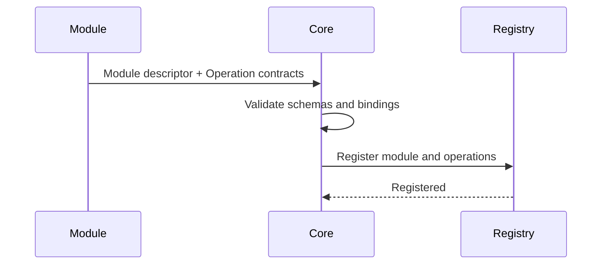

# Manafield Module Protocol

> Draft protocol notes. Nothing in this document is stable yet.
>
> **The Korean documentation is the primary source of truth.**  
> If this English version differs from the Korean version, the Korean version takes precedence.

## 1. Principle

Manafield Modules communicate with Core through a language-independent protocol.

> **The protocol is the contract.**

A Module should not need to import Manafield Core code or use a mandatory SDK.

Language-specific SDKs may exist for convenience, but they must remain optional.

> The DataSchema, Binding, Codec, and Health Operation model is documented separately in [Operation](operation.md).

## 2. Operations, Bindings, and Codecs

Manafield represents callable functionality exposed by a Module as an **Operation**.

An Operation is transport-neutral. The concrete invocation mechanism is separated into a **Binding**.

The initial implementation supports only an HTTP binding.

```text
Operation
├─ Input Schema
├─ Output Schema
└─ Binding
   └─ HTTP
      └─ Codec
         ├─ JSON
         └─ MessagePack
```

Additional bindings such as gRPC, TCP, WebSocket, or other mechanisms may be introduced when they are actually needed.

HTTP is the **first implemented binding**, not a restriction that makes the entire Manafield Module Protocol HTTP-only.

A Binding describes how an Operation is invoked, while a **Codec describes how its payload is serialized on the wire**.

The initial HTTP binding supports:

- **JSON** — the default human-readable format for inspection and debugging
- **MessagePack** — an optional compact binary representation of the same data model

HTTP uses `Accept` / `Content-Type` for codec selection.

```http
Accept: application/json
```

or:

```http
Accept: application/msgpack
```

Rather than defining one abstract `binary` mode, Manafield declares concrete wire codecs. Additional formats such as CBOR or Protobuf may be introduced later as separate codecs or binding-specific policies.

## 3. Minimal Endpoints

Early protocol experiments may begin with:

```http
GET /manafield/health
GET /manafield/info

GET /manafield/settings/schema
GET /manafield/settings
PUT /manafield/settings
```

These routes are examples, not a finalized specification.

## 4. Module Information

Example:

```json
{
  "id": "example",
  "name": "Example Module",
  "description": "Optional human-readable text for search results and listings",
  "version": "0.1.0",
  "apiVersion": "v1",
  "tags": [
    "example"
  ]
}
```

Possible responsibilities of the info endpoint:

- identity
- optional human-readable description
- Module version
- supported Manafield protocol version
- tags for search and classification
- provided Capability Contract metadata
- optional Web contribution metadata

## 5. Operation Discovery

A Module describes its callable functionality to Core as a list of **Operation Contracts**.

At the developer level, this can be thought of as:

```text
Operation<Input, Output>
```

Core cannot know language-specific types from arbitrary external Modules, so Input and Output are represented using **language-independent schemas**.

When an Operation is exposed over HTTP, its HTTP-specific details live in the Binding rather than in the Operation itself.

Example:

```json
{
  "id": "echo",
  "description": "Returns the supplied message.",
  "input": {
    "type": "object",
    "required": ["message"],
    "properties": {
      "message": { "type": "string" }
    }
  },
  "output": {
    "type": "object",
    "required": ["message"],
    "properties": {
      "message": { "type": "string" }
    }
  },
  "binding": {
    "type": "http",
    "method": "POST",
    "path": "/echo",
    "codecs": ["json", "messagepack"]
  }
}
```

The initial Rust model follows this concept:

```rust
struct OperationContract {
    id: String,
    description: Option<String>,
    input: Option<DataSchema>,
    output: Option<DataSchema>,
    binding: OperationBinding,
}

enum OperationBinding {
    Http {
        method: HttpMethod,
        path: String,
        codecs: Vec<PayloadCodec>,
    },
}
```

At the moment, `OperationBinding` contains only HTTP. New variants are added when another invocation mechanism is actually supported.

### DataSchema

Operation Input/Output values are no longer stored as arbitrary JSON values. They are deserialized into Manafield Core's typed `DataSchema`.

The initial schema types are:

- `string`
- `integer`
- `number`
- `boolean`
- `array` — contains another `DataSchema` in `items`
- `object` — contains named `DataSchema` values in `properties` and declares required fields with `required`

Arrays and objects can recursively contain other schemas, allowing nested data structures.

Example:

```json
{
  "type": "object",
  "required": ["name", "tags"],
  "properties": {
    "name": { "type": "string" },
    "tags": {
      "type": "array",
      "items": { "type": "string" }
    }
  }
}
```

Core also validates that Object Schema entries listed in `required` exist in `properties` and are not duplicated.

### Health Operation Reference

A Module may optionally specify one Operation ID through `healthOperation`.

```json
{
  "id": "example",
  "name": "Example Module",
  "description": "Example implementation of the Module Protocol",
  "version": "0.1.0",
  "healthOperation": "health",
  "operations": [
    {
      "id": "health",
      "description": "Reports Module health.",
      "input": null,
      "output": {
        "type": "object",
        "properties": {
          "status": { "type": "string" }
        },
        "required": ["status"]
      },
      "binding": {
        "type": "http",
        "method": "GET",
        "path": "/manafield/health",
        "codecs": ["json"]
      }
    }
  ]
}
```

`healthOperation` is a reference to an existing Operation rather than a duplicate health-check definition.

Core validates that:

- the referenced Operation ID exists in `operations`
- the Health Operation can be invoked without additional input, so its `input` must be `null`

This allows a health checker to directly use the declared Operation instead of inferring one from the full Operation list.

The initial `PayloadCodec` variants are `Json` and `MessagePack`. Serde allows the same Rust data model to be serialized into either representation, and a Module can advertise its supported codecs as binding metadata.

When a Module is registered, Core stores the Module descriptor and its Operation contracts together in the Registry.



This allows Core and Web/CLI clients to discover, without knowing the Module's implementation language:

- available Operations
- optional human-readable Operation descriptions
- expected Input Schemas
- expected Output Schemas
- the Binding used to invoke each Operation
- HTTP method and path when the Binding is HTTP
- codecs supported by that Binding
- future permission requirements and Capability membership metadata

Operation information is the **discovery and validation contract for callable functionality**.

Web exposure is not derived automatically from Operation IDs or Binding paths. Public hostnames and paths are instance-level policy in the private Instance Definition. Current host exposure can be resolved through the Build Plan and an Ingress Adapter. See [ADR-0009](adr/0009-operation-web-exposure.md) for this boundary.

The current Core Module discovery response experimentally supports HTTP content negotiation. JSON is the default response, while `Accept: application/msgpack` returns MessagePack binary data.

## 6. Manifest

A Module may provide a manifest that Core can validate before installation or registration.

Concept example:

```yaml
id: example
name: Example Module
version: 0.1.0

manafieldApi: v1
type: module

runtime:
  type: container

container:
  image: ghcr.io/example/example-module:0.1.0
  port: 8080

healthOperation: health

operations:
  - id: health
    input: null
    output:
      type: object
      properties:
        status:
          type: string
      required:
        - status
    binding:
      type: http
      method: GET
      path: /manafield/health
      codecs:
        - json

permissions:
  - example.read
```

The manifest schema is not finalized.

Public hostname/path exposure is intentionally not part of this Manifest example. A Module may provide a Web surface, while the actual external location is selected by the Instance Definition.

Example:

```yaml
modules:
  - id: example
    exposure:
      type: host
      host: example.manafield.studio
      targetPort: 8080
```

This allows the same Module repository to be reused by different instances with different exposure policies.

### Current development-time Module discovery

Core can use the `MANAFIELD_MODULES_DIR` environment variable to select the root directory for Module discovery. The default is `modules`.

Core recursively searches that directory for files named `manafield.module.json`.

```text
MANAFIELD_MODULES_DIR
        ↓
discover manafield.module.json
        ↓
JSON → ModuleDescriptor
        ↓
Registry validation
        ↓
ModuleRegistry
```

Current validation rules include:

- Module ID, name, and version must not be empty
- Operation IDs must be unique within a Module
- HTTP paths must begin with `/`
- HTTP Operations must declare at least one Codec
- when `healthOperation` is set, the referenced Operation ID must exist
- the Health Operation must not require input
- duplicate Module IDs cannot be registered

Invalid manifests are not silently ignored; they cause Core startup to fail.

`examples/modules/sample/manafield.module.json` in the repository is the current implementation example.

This is a development-time Descriptor/Manifest shape and may evolve as installation metadata such as Runtime, permissions, and dependencies is added.

### Runtime Registry API

Module descriptors can also be registered and removed while Core is running.

```http
POST   /modules
GET    /modules
GET    /modules/{id}
DELETE /modules/{id}
```

`POST /modules` accepts `application/json` and `application/msgpack` request bodies. Response serialization is selected through the `Accept` header.

After a successful registration or removal, `ModuleRegistry` is mutated, a new `RegistrySnapshot` is built, and the snapshot is immediately published through `ArcSwap`. Read requests use the current snapshot rather than the mutable Registry.

Current primary status codes are:

- successful registration: `201 Created`
- duplicate Module ID: `409 Conflict`
- invalid Module Descriptor: `400 Bad Request`
- missing Module on lookup/removal: `404 Not Found`
- unsupported request Codec: `415 Unsupported Media Type`

## 7. Compatibility Goal

A future Core implementation should be replaceable without forcing Modules to be rewritten, as long as both sides implement the same protocol version.

For example:

```text
Rust Core v0.x
      ↓ replaced

Go Core vNext

Module Protocol v1 remains stable
      ↓

Existing Modules continue to work
```

This is an architectural goal, not a compatibility guarantee yet.

## 8. Capabilities and Dependencies

A Module ID identifies a concrete implementation and is not the default dependency contract.

When a Module needs functionality from another Module, it should normally require a **Capability Contract** instead of a concrete Module name.

Conceptual example:

```yaml
requires:
  capabilities:
    identity:
      id: manafield.identity
      version: 1
```

Modules can provide the same contract independently of their implementation IDs.

```yaml
provides:
  capabilities:
    - id: manafield.identity
      version: 1
      description: User identity and session functionality
```

`description` is nullable/optional human-readable metadata for search results and management UI. It does not participate in dependency resolution.

`tags` are also useful for discovery and classification, but they are not compatibility contracts and do not satisfy dependencies.

```text
Operation
→ one callable functionality contract

Capability
→ compatibility contract composed from Operations and semantic rules

Tag
→ descriptive / non-binding metadata
```

Infrastructure needs such as databases, caches, and object storage use the same Capability model.

```yaml
requires:
  capabilities:
    state:
      id: database.postgresql
      version: "^1.0.0"
```

`database.postgresql` is a Capability Contract, not a separate Resource Requirement type.

The Instance may bind this Capability to a concrete Resource such as `main-postgres`. A PostgreSQL Provider may prepare connection information, while application SQL still goes directly from the Module through its native JDBC, `pg`, `psycopg`, or equivalent client.

Capability versions are **SemVer contract versions** independent from Module release versions. Providers declare exact versions and consumers declare SemVer ranges. The Resolver does not infer compatibility from Operation subsets.

See [Capability Contract](capability.md) for the v0 model. The long-lived boundary follows [ADR-0010](adr/0010-capability-dependency-resolution.md).

## 9. Module Templates

Core and Module templates are expected to live in separate repositories.

Initial requirements extracted from `manafield-reference` are documented in [Module Template Requirements v0](module-template-requirements.md).

Possible templates:

```text
manafield-module-template-ts-react
manafield-module-template-go
manafield-module-template-python
```

A developer should be able to start from a template repository and implement the protocol without cloning Manafield Core.

Do not freeze a Template too early from a single Reference implementation; validate the shared pieces again after a second real Module is implemented.

## 10. Security Direction

The protocol should represent **permission requests** and **dependency Capabilities** as distinct concepts. A Capability is a compatibility contract, not a permission name or free-form tag.

A Module package should eventually be able to declare:

- requested permissions
- provided / required Capabilities
- required Capabilities
- runtime requirements
- exposed ports
- storage requirements
- Capability binding metadata
- Web contributions

The exact security model will be designed after the basic protocol and Docker runtime are functional.
