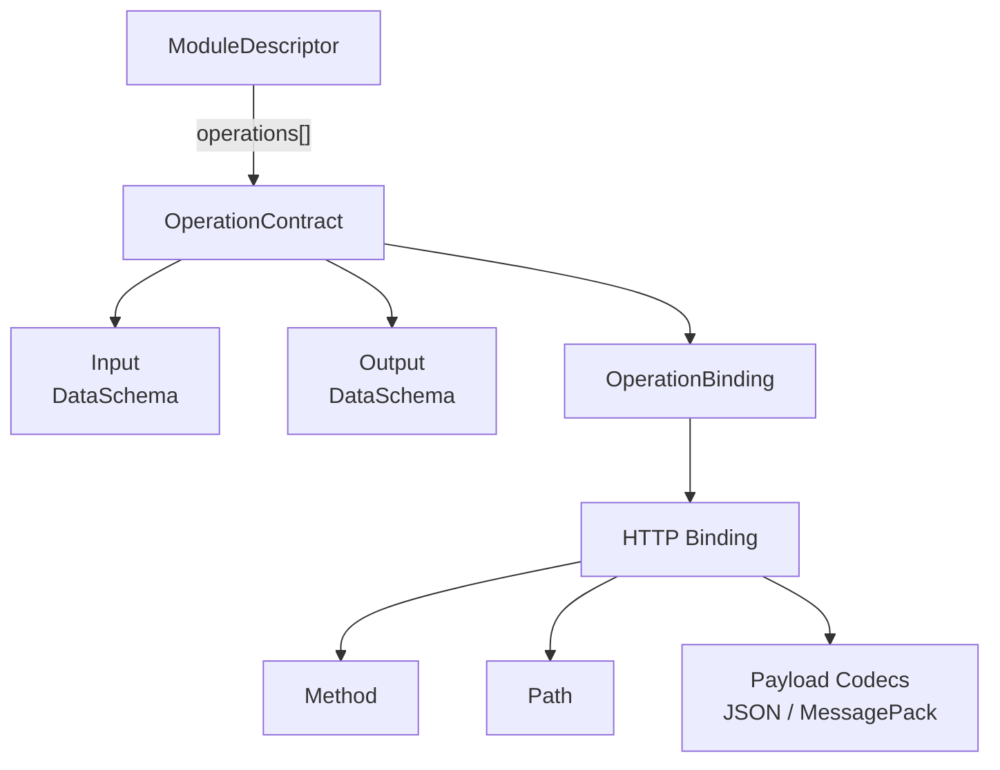
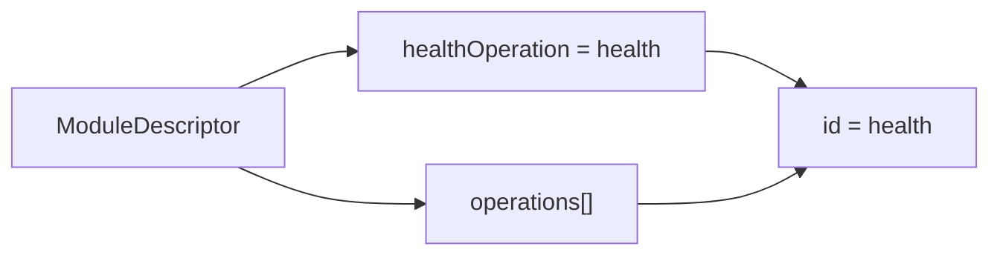
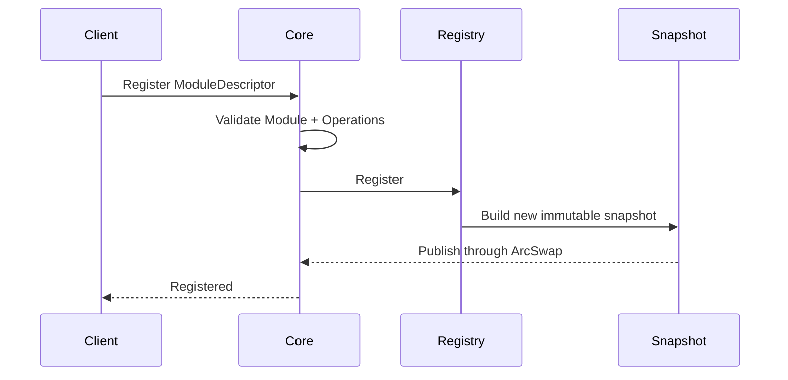

# Manafield Operation

> This document describes the current design of the **Operation Contract** exposed by Manafield Modules.  
> Manafield is still in the **pre-alpha / design stage**, so details may change.
>
> **The Korean documentation is the primary source of truth.**  
> If this English version differs from the Korean version, the Korean version takes precedence.

## 1. What is an Operation?

In Manafield, an **Operation** is the contract for callable functionality exposed by a Module.

An Operation describes:

- the ID used to identify the capability
- the expected input
- the expected output
- how the capability can be invoked

Conceptually:

```text
Operation<Input, Output>
```

The Module's implementation language is not part of the Operation Contract.

The goal is to express the same contract whether the Module is implemented in Python, Go, Node.js, Java, Rust, or another environment.

## 2. Current Structure

The current Rust model follows this concept:

```rust
struct OperationContract {
    id: String,
    input: Option<DataSchema>,
    output: Option<DataSchema>,
    binding: OperationBinding,
}
```

The overall structure is:



Operation Contracts are currently stored in the Module Registry as **discovery and validation metadata**.

Automatic Operation proxying / invocation is not implemented yet.

## 3. Input / Output

Operation Input and Output use a language-independent **DataSchema** rather than language-specific types.

When an Operation has no input or output, the corresponding field may be `null`.

Example:

```json
{
  "id": "echo",
  "input": {
    "type": "object",
    "required": ["message"],
    "properties": {
      "message": {
        "type": "string"
      }
    }
  },
  "output": {
    "type": "object",
    "required": ["message"],
    "properties": {
      "message": {
        "type": "string"
      }
    }
  }
}
```

The currently supported DataSchema types are:

| Type | Meaning |
| --- | --- |
| `string` | String |
| `integer` | Integer |
| `number` | Number |
| `boolean` | Boolean |
| `array` | Array containing items described by another schema |
| `object` | Object containing named properties |

Arrays and objects can recursively contain other DataSchema values.

Example:

```json
{
  "type": "object",
  "required": ["name", "tags"],
  "properties": {
    "name": {
      "type": "string"
    },
    "tags": {
      "type": "array",
      "items": {
        "type": "string"
      }
    }
  }
}
```

Core validates that Object Schema entries listed in `required` exist in `properties` and are not duplicated.

## 4. Binding

An Operation itself is not tied to a particular transport.

The concrete invocation mechanism is represented by **OperationBinding**.

HTTP is currently the only implemented Binding.

```rust
enum OperationBinding {
    Http {
        method: HttpMethod,
        path: String,
        codecs: Vec<PayloadCodec>,
    },
}
```

The currently supported HTTP methods are:

- `GET`
- `POST`

Additional HTTP methods or new bindings such as gRPC, TCP, and WebSocket may be added when they are actually needed.

HTTP is therefore the first implemented Binding, not a restriction that makes the Operation model HTTP-only.

## 5. Codec

A Binding describes **how an Operation is invoked**, while a Codec describes **how its payload is represented on the wire**.

The current HTTP Binding supports:

- `json`
- `messagepack`

Example:

```json
{
  "binding": {
    "type": "http",
    "method": "POST",
    "path": "/echo",
    "codecs": [
      "json",
      "messagepack"
    ]
  }
}
```

HTTP codec selection uses headers such as:

```http
Content-Type: application/json
Accept: application/json
```

or:

```http
Content-Type: application/msgpack
Accept: application/msgpack
```

Manafield declares concrete serialization formats rather than using a single abstract `binary` mode.

## 6. Health Operation

A Module may optionally reference one Operation for health checking.

```json
{
  "healthOperation": "health"
}
```

This is a reference to an existing Operation in `operations[]`, not a duplicate health-check definition.



Core currently validates that:

- when `healthOperation` is set, the referenced Operation exists
- the Health Operation has `input: null` so it can be invoked without additional input

The Health Operation output schema is not currently fixed.

## 7. Full Example

```json
{
  "id": "sample",
  "name": "Sample Module",
  "version": "0.0.1",
  "healthOperation": "health",
  "operations": [
    {
      "id": "health",
      "input": null,
      "output": {
        "type": "object",
        "required": ["status"],
        "properties": {
          "status": {
            "type": "string"
          }
        }
      },
      "binding": {
        "type": "http",
        "method": "GET",
        "path": "/manafield/health",
        "codecs": [
          "json",
          "messagepack"
        ]
      }
    },
    {
      "id": "echo",
      "input": {
        "type": "object",
        "required": ["message"],
        "properties": {
          "message": {
            "type": "string"
          }
        }
      },
      "output": {
        "type": "object",
        "required": ["message"],
        "properties": {
          "message": {
            "type": "string"
          }
        }
      },
      "binding": {
        "type": "http",
        "method": "POST",
        "path": "/echo",
        "codecs": [
          "json",
          "messagepack"
        ]
      }
    }
  ]
}
```

## 8. Relationship with the Registry

When a Module is registered, its Operation Contracts are registered as part of the Module Descriptor.



Readers do not query the mutable Registry directly. They read Module and Operation information from the current `RegistrySnapshot`.

## 9. Current Validation Rules

The current Core implementation validates the following Operation rules:

- Operation IDs must not be empty
- Operation IDs must be unique within a Module
- Input / Output DataSchema values must be valid
- HTTP paths must begin with `/`
- HTTP Operations must declare at least one Codec
- `healthOperation` must reference an existing Operation
- the Health Operation must not require Input

These rules reflect the current implementation and may evolve as the Protocol stabilizes.
