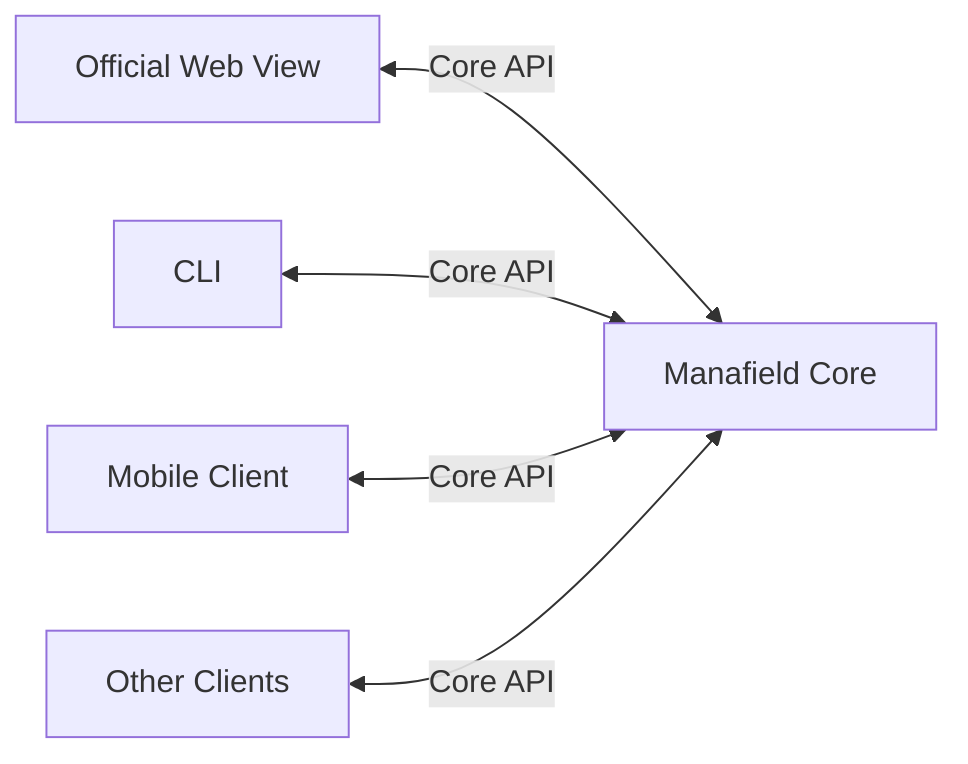
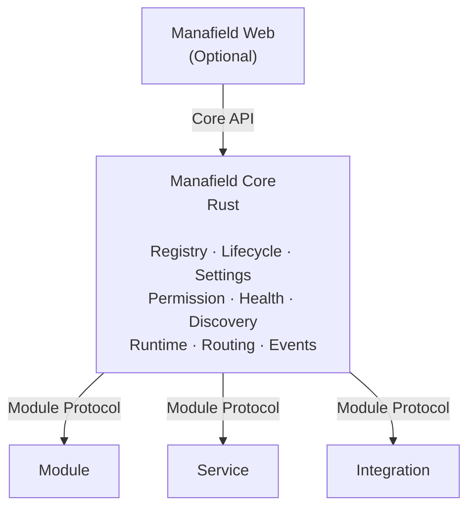
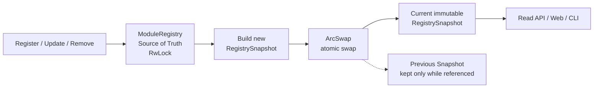
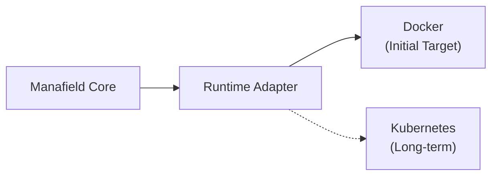
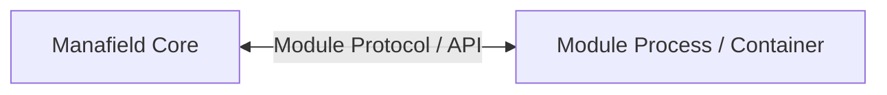

# Manafield Architecture

> 이 문서는 현재 Manafield의 아키텍처 방향을 설명합니다.  
> Manafield는 아직 **pre-alpha / design stage**이며 세부 설계는 변경될 수 있습니다.
>
> **한국어 문서를 기준 문서로 우선합니다.**  
> 영문판과 내용이 다를 경우 이 한국어판을 우선합니다.

## 1. 프로젝트 정의

Manafield는 **모듈형 개인 플랫폼**입니다.

하나의 웹사이트나 특정 UI에 종속된 애플리케이션이 아닙니다.

작은 Control Plane을 중심으로 다음과 같은 구성요소를 연결하고 관리하는 것을 목표로 합니다.

- Module
- 독립 Service
- Bot
- 기록 시스템
- 외부 Integration
- 선택적인 Web Interface

`manafield.studio`는 Manafield 자체가 아니라, Manafield 위에 구성된 하나의 인스턴스입니다.

## 2. 개발 기준 버전

현재 Manafield Core의 개발 기준 Rust toolchain은 **Rust 1.99.0**입니다.

```text
rustc 1.99.0
cargo 1.99.0
```

이는 현재 개발 및 검증 기준 버전이며, 아직 프로젝트의 공식 **MSRV(Minimum Supported Rust Version)** 를 의미하지 않습니다.

향후 안정화 단계에서 실제 지원 가능한 최소 Rust 버전을 별도로 정의할 수 있습니다.

## 3. Core 철학

### Strict Core, Free Modules

Core는 일관성과 예측 가능성이 필요한 영역을 책임집니다.

- Module Registry
- Manifest validation
- Module lifecycle
- Runtime abstraction
- Authentication / Permission
- Settings
- Health check
- Service discovery
- Routing metadata
- Event / Message

Module의 내부 구현은 의도적으로 최대한 자유롭게 둡니다.

Module은 Python, Go, Node.js, Java, Rust 또는 Protocol을 구현할 수 있는 다른 환경으로 작성할 수 있습니다.

## 4. Headless Core

Manafield Core는 **Headless**를 기본 구조로 합니다.

즉 Core가 동작하기 위해 내장 Web UI가 필수적이지 않습니다.



공식 Web View를 별도로 제공할 수 있지만, Core와 Module은 Web 없이도 동작할 수 있어야 합니다.

## 5. 상위 구조



### Registry Read Model

Module Registry는 쓰기 원본과 읽기 Snapshot을 분리합니다.

- `ModuleRegistry`는 Module 등록/변경의 Source of Truth입니다.
- 쓰기 작업은 `RwLock`을 통해 직렬화합니다.
- 변경이 완료되면 새로운 불변 `RegistrySnapshot`을 생성합니다.
- 현재 Snapshot은 `ArcSwap`으로 원자적으로 교체합니다.
- 일반 조회는 `RwLock`을 거치지 않고 현재 Snapshot을 읽습니다.
- 이전 Snapshot은 그것을 참조하는 Reader가 모두 사라지면 `Arc` 참조 카운트에 따라 자동으로 해제됩니다.



Snapshot 생성과 교체는 Registry write lock을 유지한 상태에서 순서대로 처리하여 여러 쓰기 요청이 서로 다른 순서로 Snapshot을 덮어쓰지 않도록 합니다. 반면 Reader는 Snapshot 생성 중에도 기존 Snapshot을 계속 읽을 수 있습니다.

Registry 변경 Event는 향후 Audit, WebSocket notification, Metrics 등에 사용할 수 있지만, 기본 Read Snapshot의 정합성은 비동기 Event 처리에 의존하지 않는 방향을 유지합니다.

## 6. 구성요소 유형

### Module

Manafield 인스턴스에 직접적인 기능을 제공합니다.

예:

- Observe
- Records
- Dashboard

### Service

독립적으로 실행되는 서비스를 Manafield에서 관리하거나 연결합니다.

예:

- Echo
- Misskey

### Integration

외부 시스템이나 플랫폼을 Manafield와 연결합니다.

예:

- ProtoDuck
- Discord
- External API

이 분류는 역할과 실행 형태를 표현하기 위한 것이며, 가능한 한 공통 Module Protocol을 공유합니다.

## 7. Runtime 모델

Manafield는 Container Runtime 자체를 구현하지 않습니다.

Core는 Runtime Adapter 경계를 통해 기존 실행 환경을 사용합니다.

초기 목표와 장기 Runtime 확장 방향은 다음과 같습니다.



개념적인 인터페이스 예시는 다음과 같습니다.

```rust
trait ModuleRuntime {
    async fn install(&self, module: &ModuleSpec) -> Result<()>;
    async fn start(&self, id: &ModuleId) -> Result<()>;
    async fn stop(&self, id: &ModuleId) -> Result<()>;
    async fn status(&self, id: &ModuleId) -> Result<ModuleStatus>;
    async fn remove(&self, id: &ModuleId) -> Result<()>;
}
```

정확한 Rust API는 아직 확정되지 않았습니다.

## 8. Web Contribution

Module은 Web UI를 제공하지 않아도 됩니다.

초기에는 다음과 같은 방식을 고려합니다.

### none

Web UI가 없습니다.

### proxy

Module이 자체 Web Application을 실행하고 Manafield가 이를 연결하거나 노출합니다.

### external

Module이 외부 URL을 제공합니다.

더 밀접한 Remote UI 또는 Web Component 방식은 초기 범위에 포함하지 않습니다.

## 9. Isolation

기본 아키텍처에서는 임의의 Module 코드를 Core 프로세스 내부에 직접 로드하지 않습니다.



이 구조는 언어 독립성을 높이고, 보안 및 장애 경계를 더 명확하게 만듭니다.

장기적으로 third-party Module에는 제한된 Container 또는 Sandbox를 적용할 수 있습니다.

## 10. Non-goals

Manafield는 다음을 새로 구현하려는 프로젝트가 아닙니다.

- Docker
- Container isolation
- Database engine
- Reverse proxy
- Kubernetes

기존 기술을 대체하는 대신, 이들을 **Module이라는 공통 모델로 연결하고 관리하는 Control Plane**을 목표로 합니다.
