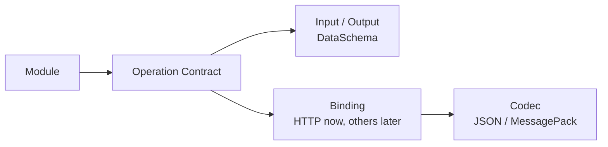
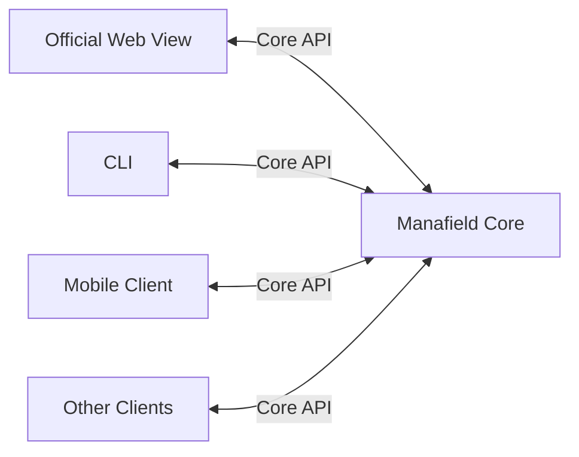
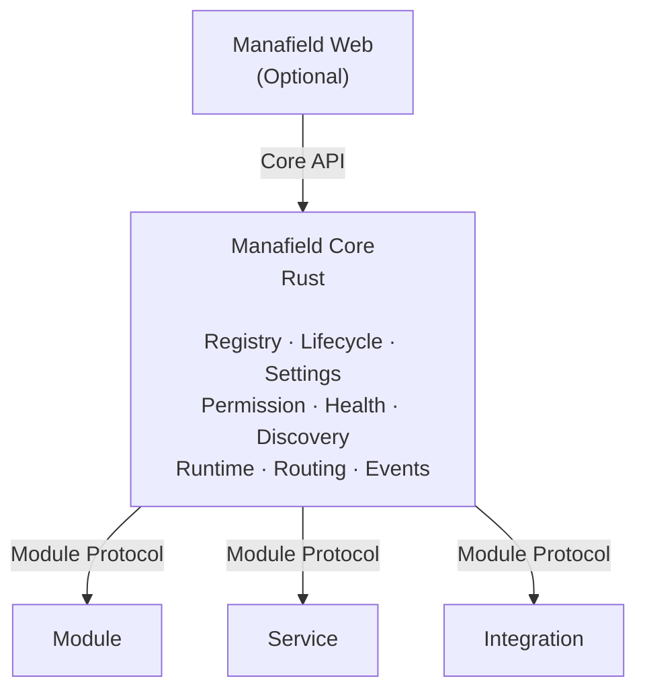
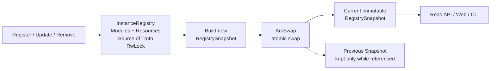
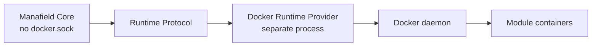
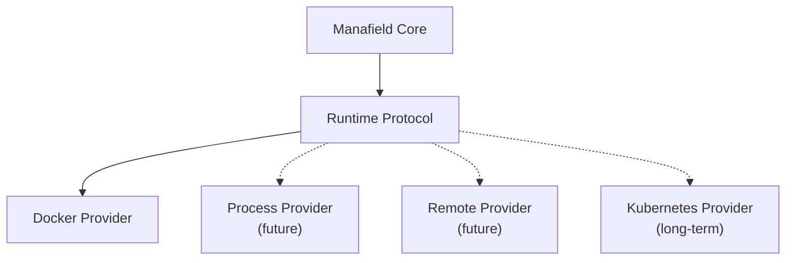
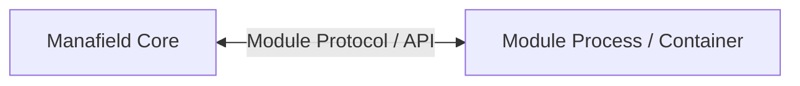

# Manafield Architecture

> 이 문서는 현재 Manafield의 아키텍처 방향을 설명합니다.  
> Manafield는 아직 **pre-alpha / design stage**이며 세부 설계는 변경될 수 있습니다.
>
> **한국어 문서를 기준 문서로 우선합니다.**  
> 영문판과 내용이 다를 경우 이 한국어판을 우선합니다.

## 1. 프로젝트 정의

Manafield는 **모듈형 개인 플랫폼**입니다.

하나의 웹사이트나 특정 UI에 종속된 애플리케이션이 아닙니다.

작은 Control Plane을 중심으로 다음과 같은 구성요소를 연결하고 관리하는 것을 목표로 합니다.

- Module
- 독립 Service
- Bot
- 기록 시스템
- 외부 Integration
- 선택적인 Web Interface

`manafield.studio`는 Manafield 자체가 아니라, Manafield 위에 구성된 하나의 인스턴스입니다.

## 2. 개발 기준 버전

현재 Manafield Core의 개발 기준 Rust toolchain은 **Rust 1.99.0**입니다.

```text
rustc 1.99.0
cargo 1.99.0
```

이는 현재 개발 및 검증 기준 버전이며, 아직 프로젝트의 공식 **MSRV(Minimum Supported Rust Version)** 를 의미하지 않습니다.

향후 안정화 단계에서 실제 지원 가능한 최소 Rust 버전을 별도로 정의할 수 있습니다.

## 3. Core 철학

### Strict Core, Free Modules

Core는 일관성과 예측 가능성이 필요한 영역을 책임집니다.

- Module Registry
- Manifest validation
- Module lifecycle
- Runtime abstraction
- Authentication / Permission
- Settings
- Health check
- Service discovery
- Routing metadata
- Event / Message

Module의 내부 구현은 의도적으로 최대한 자유롭게 둡니다.

Module은 Python, Go, Node.js, Java, Rust 또는 Protocol을 구현할 수 있는 다른 환경으로 작성할 수 있습니다.

### Boundary-first Development

Manafield는 **나중에 분리하기 비싼 경계와 책임은 장기 구조를 기준으로 먼저 설계하고, 각 구성요소의 내부 구현은 현재 필요한 만큼만 채우는 방식**을 따릅니다.

즉 미래 기능을 모두 미리 구현하지는 않지만, 다음과 같은 경계는 초기에 명시적으로 둡니다.

- Core와 Module
- Operation과 Binding / Codec
- Registry Write Model과 Read Snapshot
- Core와 Runtime Provider
- 일반 Module과 privileged system component
- Module identity와 Capability Contract
- 모든 일반 requirement를 Capability Contract로 표현하는 경계

주요 Architecture 결정과 이유는 [ADR](adr/README.md)에 기록합니다.

### Operation의 역할

Manafield에서 **Operation**은 Module이 외부에 제공하는 호출 가능한 기능을 표현하는 공통 계약입니다.

Core는 Module 내부의 함수나 클래스 구조를 직접 알지 않습니다. 대신 Module Descriptor에 포함된 Operation Contract를 통해 다음을 이해합니다.

- 어떤 기능을 제공하는지
- 어떤 Input / Output Schema를 사용하는지
- 어떤 Binding으로 호출하는지
- 어떤 Codec으로 Payload를 주고받는지

따라서 Module 구현은 자유롭게 유지하면서도, Core와 다른 Client는 동일한 방식으로 기능을 탐색하고 검증할 수 있습니다.



Operation의 상세 구조는 [Operation](operation.md) 문서를 참고합니다.

### Capability와 Dependency의 역할

Operation은 하나의 호출 가능한 기능을 표현하지만, Module 간 dependency는 특정 구현체 ID나 단일 route 이름에 직접 고정하지 않습니다.

Manafield는 **Capability Contract**를 Module identity와 분리합니다.

```text
Module ID
→ concrete implementation identity

Operation
→ one callable contract

Capability
→ interchangeable implementations가 공통으로 만족하는 compatibility contract

Tag
→ 검색 / 분류용 non-binding metadata
```

Capability compatibility에 사용하는 핵심 표면은 `id + version`입니다. Description과 tags는 검색/관리 UI용 metadata이며 matching에는 사용하지 않습니다.

Module Instance와 Resource Instance는 같은 방식으로 Capability metadata를 등록할 수 있습니다. 이를 위해 동일 언어의 공통 `CapabilityProvider` 구현 인터페이스를 강제하지 않습니다.

예를 들어 Echo는 특정 `manafield-account` Module보다 `manafield.identity ^1` Capability를 요구할 수 있고, `database.postgresql ^1`도 같은 `requires.capabilities` 문법으로 요구합니다.

Concrete 연결은 consumer Instance의 Requirement slot에서 target Instance ID를 명시하는 Binding으로 표현합니다.

```text
echo-prod.identity → identity-core
echo-prod.state    → main-postgres
```

Module/Resource Instance ID는 하나의 Manafield Instance 안에서 unique하며 중복 등록은 conflict로 거부합니다.

Binding되지 않은 Requirement는 호환 후보가 몇 개 존재하든 계속 UNBOUND입니다. Capability Discovery는 compatible 조회, 이름 일치 기반 advanced 조회, 전체 조회를 제공할 수 있지만 Binding을 자동 생성하지 않습니다.

Binding된 target의 Capability version이 요구 range와 다르면 `CAPABILITY_VERSION_MISMATCH` warning과 diagnostic log를 남기되 version mismatch 하나만으로 실행을 강제 중단하지 않습니다.

Endpoint, concrete config value, connection metadata와 secret reference는 concrete Instance/Instance configuration에 두고, config schema는 Module/Resource Definition에 둡니다. Capability Contract에는 이런 runtime/configuration 정보를 넣지 않습니다.

Resource를 준비/등록/관리하는 system-side component는 별도 boundary로 둘 수 있지만, Capability binding target은 관리 컴포넌트가 아니라 concrete Resource Instance입니다. 실제 application data path도 Core를 통과하지 않습니다.

자세한 계약 모델은 [Capability Contract v0](capability.md)와 [ADR-0010](adr/0010-capability-dependency-resolution.md)을 참고합니다.

## 4. Headless Core

Manafield Core는 **Headless**를 기본 구조로 합니다.

즉 Core가 동작하기 위해 내장 Web UI가 필수적이지 않습니다.



공식 Web View를 별도로 제공할 수 있지만, Core와 Module은 Web 없이도 동작할 수 있어야 합니다.

Manafield binary는 기본 headless 운영 surface이자 Instance 실행 entrypoint로 CLI를 함께 제공합니다.

```text
manafield health
manafield ps
manafield resource [id]
manafield plan [instance.yaml]
```

`health`, `ps`, `resource` 같은 운영 command는 Docker나 Resource 구현을 직접 해석하지 않고 Core API를 사용합니다. 반면 `plan`과 앞으로 추가할 `build / deploy / verify` 계열 command는 Instance Definition과 deployment executor를 다룹니다.

Module이 CLI command metadata를 선언해 기능을 확장하는 방식은 별도 contract로 설계할 수 있지만, Module 코드를 Core process에 직접 로드하지 않는 원칙은 유지합니다.

## 5. 상위 구조



### Registry Read Model

Instance Registry는 쓰기 원본과 읽기 Snapshot을 분리합니다.

- `InstanceRegistry`는 Module Instance와 Resource Instance 등록/변경의 Source of Truth입니다.
- Module/Resource Instance ID는 같은 namespace에서 unique합니다.
- 쓰기 작업은 `RwLock`을 통해 직렬화합니다.
- 변경이 완료되면 새로운 불변 `RegistrySnapshot`을 생성합니다.
- 현재 Snapshot은 `ArcSwap`으로 원자적으로 교체합니다.
- 일반 조회는 `RwLock`을 거치지 않고 현재 Snapshot을 읽습니다.
- 이전 Snapshot은 그것을 참조하는 Reader가 모두 사라지면 `Arc` 참조 카운트에 따라 자동으로 해제됩니다.



Snapshot 생성과 교체는 Registry write lock을 유지한 상태에서 순서대로 처리하여 여러 쓰기 요청이 서로 다른 순서로 Snapshot을 덮어쓰지 않도록 합니다. 반면 Reader는 Snapshot 생성 중에도 기존 Snapshot을 계속 읽을 수 있습니다.

Registry 변경 Event는 향후 Audit, WebSocket notification, Metrics 등에 사용할 수 있지만, 기본 Read Snapshot의 정합성은 비동기 Event 처리에 의존하지 않는 방향을 유지합니다.

## 6. 구성요소 유형

### Module

Manafield 인스턴스에 직접적인 기능을 제공합니다.

예:

- Observe
- Records
- Dashboard

### Service

독립적으로 실행되는 서비스를 Manafield에서 관리하거나 연결합니다.

예:

- Echo
- Misskey

### Integration

외부 시스템이나 플랫폼을 Manafield와 연결합니다.

예:

- ProtoDuck
- Discord
- External API

Module / Service / Integration 분류는 역할과 실행 형태를 표현하기 위한 것이며, 가능한 한 공통 Module Protocol을 공유합니다.

### Provider

Provider는 일반 Module이 아니라 **Manafield 시스템에 실행환경, 기반 자원, ingress 같은 infrastructure 기능을 연결하는 system-side component**입니다.

예:

- Docker Runtime Provider
- PostgreSQL Resource Provider
- Traefik Ingress Provider / Adapter

Provider는 사용자 기능을 직접 제공하는 Module과 달리 더 강한 권한이나 host infrastructure 접근이 필요할 수 있으므로 별도 boundary를 가집니다.

## 7. Runtime 모델

Manafield Core는 특정 실행 기술에 종속되지 않습니다.

Module을 실제로 생성하고 시작하고 중지하고 제거하는 역할은 **Runtime Provider**가 담당합니다. Runtime Provider는 일반 Module이 아니라 실행 환경을 제어하는 privileged system component입니다.

Core는 Runtime Provider가 없어도 Registry, Operation Discovery, Validation 같은 기본 기능을 수행할 수 있어야 합니다.

다만 **지원되는 Manafield v0 전체 Instance 구축/배포 환경에는 Docker가 필요합니다.** 이는 Core가 Docker에 종속된다는 뜻이 아니라, v0 deployment executor의 기준 runtime을 Docker로 고정한다는 뜻입니다.

Instance 실행의 canonical entrypoint는 `manafield` CLI이며, Jenkins는 이 CLI를 원격에서 호출하는 첫 공식 CI/CD frontend로 취급합니다. 자세한 결정은 [ADR-0013](adr/0013-docker-v0-cli-execution.md)을 참고합니다.



초기 Docker Provider는 Core와 **같은 Repository / Release**에서 관리하되 별도 Binary / Process로 실행하는 방향을 사용합니다.

```text
same source / release
├─ manafield
└─ manafield-runtime-docker
```

Docker 배포에서는 Core에 `docker.sock`을 제공하지 않고 Docker Runtime Provider에만 제공합니다. 이를 통해 Docker-specific privilege와 policy를 Core의 일반 API / Registry 로직에서 분리합니다.

Core와 Provider 사이에는 제한된 **Runtime Protocol**을 둡니다. 이 Protocol은 임의 Docker 명령 실행 API가 아니라 Manafield lifecycle 수준의 요청을 표현해야 합니다.

예:

```text
Create
Start
Stop
Remove
Status
```

초기 local transport로는 Unix Domain Socket을 우선 검토합니다. 향후 필요하다면 Process, Remote, Kubernetes 등 다른 Runtime Provider를 추가할 수 있습니다.



Runtime Provider의 상세 Protocol과 capability 모델은 아직 설계 중입니다. 결정 배경은 [ADR-0004](adr/0004-runtime-provider-boundary.md)와 [ADR-0005](adr/0005-docker-provider-isolation.md)를 참고합니다.

### Provider Family

Runtime Provider 외에도 기반 자원을 준비하는 **Resource Provider**를 둘 수 있습니다.

예:

```text
Provider
├─ Runtime Provider
│  └─ Docker
├─ Resource Provider
│  └─ PostgreSQL
└─ Ingress Provider / Adapter
   └─ Traefik
```

이 분류는 “일반 Module은 아니지만 Manafield에 시스템 기능을 추가하는 구성요소”라는 공통 성격을 표현합니다.

다만 Runtime, Resource, Ingress는 권한과 lifecycle이 서로 다르므로 하나의 만능 Provider Protocol로 성급하게 통합하지 않습니다. 각 Provider 종류의 Protocol과 보안 경계는 필요할 때 별도로 정의합니다.

### Network Planes

Manafield의 Docker 배포는 내부 Module 통신과 외부 공개 경계를 별도 네트워크로 분리합니다.

```text
manafield-modules
→ Core ↔ Module 내부 통신

manafield-edge
→ Traefik / Cloudflared / 외부 공개 Module이 만나는 edge network
```

Core는 기본적으로 `manafield-modules`에만 연결합니다. 외부 Web surface를 제공해야 하는 Module만 필요에 따라 `manafield-edge`에도 함께 연결합니다.

`manafield-edge`는 개별 Manafield Compose가 소유하지 않는 external Docker network로 취급합니다. 자세한 결정 배경은 [ADR-0008](adr/0008-network-planes.md)을 참고합니다.

## 8. Web Contribution / Exposure

Module은 Web UI를 제공하지 않아도 됩니다.

Module이 Web surface를 제공하는 사실과 **어떤 public hostname/path로 노출할지**는 분리합니다. 실제 public exposure는 private Instance Definition과 Ingress Provider가 결정합니다.

현재 Web Exposure 모델은 다음 방향을 사용합니다.

- `none` — 외부 Web 노출 없음
- `host` — 전용 hostname으로 노출
- `prefix` — 특정 path prefix 아래에 노출
- `routes` — 명시적인 root-level route claim
- `external` — Manafield 밖의 외부 URL 사용

Operation ID나 Binding path에서 public URL을 자동으로 파생하지 않습니다.

자세한 결정은 [ADR-0009](adr/0009-operation-web-exposure.md)을 참고합니다.

### Official Web Shell

공식 Web View는 Core에 내장하지 않고 별도 `manafield-web` Module로 둡니다.

통합형 Instance는 하나의 public origin 아래 여러 Module Web surface를 path routing으로 조립할 수 있습니다.

```text
manafield.studio/           → manafield-web
manafield.studio/account/*  → Account Module
manafield.studio/echo/*     → Echo Module
```

`manafield-web`은 home, navigation, Registry discovery, session 진입 UX 같은 presentation 책임을 맡을 수 있지만 모든 Module API의 mandatory reverse proxy가 되지는 않습니다. 일반 traffic은 Ingress가 해당 Module로 직접 전달하는 방향을 우선합니다.

초기 Official Web Shell 구현은 Go 기반 single-binary Web Module로 시작합니다. Core와 일반 Module은 Web Shell 없이도 동작해야 하며, 일반 Module은 Web Shell에 의존하지 않습니다.

초기 composition은 full-page/path surface를 사용하고 dynamic micro-frontend loading은 실제 필요가 생길 때까지 미룹니다.

자세한 결정은 [ADR-0011](adr/0011-official-web-shell.md)을 참고합니다.

## 9. Isolation

기본 아키텍처에서는 임의의 Module 코드를 Core 프로세스 내부에 직접 로드하지 않습니다.



이 구조는 언어 독립성을 높이고, 보안 및 장애 경계를 더 명확하게 만듭니다.

장기적으로 third-party Module에는 제한된 Container 또는 Sandbox를 적용할 수 있습니다.

## 10. Non-goals

Manafield는 다음을 새로 구현하려는 프로젝트가 아닙니다.

- Docker
- Container isolation
- Database engine
- Reverse proxy
- Kubernetes

기존 기술을 대체하는 대신, **Module과 Provider의 명시적인 계약을 통해 기존 기술을 연결하고 관리하는 Control Plane**을 목표로 합니다.
