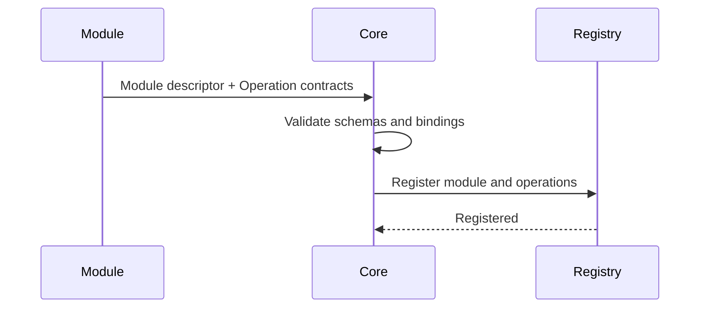

# Manafield Module Protocol

> 이 문서는 초안입니다. 아직 안정화된 규격이 아닙니다.
>
> **한국어 문서를 기준 문서로 우선합니다.**  
> 영문판과 내용이 다를 경우 이 한국어판을 우선합니다.

## 1. 원칙

Manafield Module은 언어에 독립적인 Protocol을 통해 Core와 통신합니다.

> **The protocol is the contract.**

Module은 Manafield Core 코드를 import하거나 필수 SDK를 사용할 필요가 없어야 합니다.

언어별 SDK는 편의를 위해 제공할 수 있지만 선택 사항이어야 합니다.

> Operation의 DataSchema, Binding, Codec, Health Operation 구조는 [Operation](operation.md) 문서에서 별도로 정리합니다.

## 2. Operation, Binding, Codec

Manafield는 Module이 제공하는 호출 가능한 기능을 **Operation**으로 표현합니다.

Operation 자체는 특정 통신 방식에 종속되지 않으며, 실제 호출 방식은 **Binding**으로 분리합니다.

초기 구현에서 지원하는 Binding은 HTTP 하나뿐입니다.

```text
Operation
├─ Input Schema
├─ Output Schema
└─ Binding
   └─ HTTP
      └─ Codec
         ├─ JSON
         └─ MessagePack
```

향후 필요에 따라 gRPC, TCP, WebSocket 또는 다른 방식의 Binding을 추가할 수 있도록 구조를 열어둡니다.

현재 HTTP는 **첫 번째 구현 대상**이지, Manafield Module Protocol 전체를 HTTP로 제한하는 의미가 아닙니다.

Binding은 연결/호출 방식을 나타내고, **Codec은 Payload를 어떤 형식으로 직렬화하는지**를 나타냅니다.

초기 HTTP Binding에서는 다음 Codec을 지원합니다.

- **JSON** — 사람이 읽고 디버깅하기 쉬운 기본 형식
- **MessagePack** — 동일한 구조를 더 compact한 바이너리 형식으로 전송하기 위한 선택지

HTTP에서는 `Accept` / `Content-Type`을 사용해 Codec을 선택하는 방향으로 구현합니다.

```http
Accept: application/json
```

또는:

```http
Accept: application/msgpack
```

`binary`라는 추상 타입 하나를 두기보다, 실제 wire format을 명시적인 Codec으로 선언합니다. 향후 CBOR, Protobuf 등 다른 형식이 필요하면 별도 Codec 또는 Binding 정책으로 확장할 수 있습니다.

## 3. 최소 Endpoint

초기 실험 단계에서는 다음과 같은 Endpoint를 고려합니다.

```http
GET /manafield/health
GET /manafield/info

GET /manafield/settings/schema
GET /manafield/settings
PUT /manafield/settings
```

위 Route는 예시이며 아직 확정된 명세가 아닙니다.

## 4. Module 정보

예시:

```json
{
  "id": "example",
  "name": "Example Module",
  "description": "사람이 검색 결과와 목록에서 확인할 수 있는 선택적인 설명",
  "version": "0.1.0",
  "apiVersion": "v1",
  "tags": [
    "example"
  ]
}
```

Info endpoint는 다음과 같은 정보를 제공할 수 있습니다.

- identity
- 사람이 읽을 수 있는 optional description
- Module version
- 지원하는 Manafield Protocol version
- 검색/분류용 tags
- 제공하는 Capability Contract metadata
- 선택적인 Web contribution metadata

## 5. Operation 자동 인식

Module은 자신의 기능을 **Operation Contract** 목록으로 Core에 설명할 수 있어야 합니다.

개발자 관점에서는 다음과 같이 생각할 수 있습니다.

```text
Operation<Input, Output>
```

Core는 외부 Module의 언어별 타입을 직접 알 수 없으므로 Input과 Output은 **언어 독립적인 Schema**로 표현합니다.

Operation이 HTTP로 제공되는 경우 HTTP 정보는 Operation 자체가 아니라 Binding에 들어갑니다.

예:

```json
{
  "id": "echo",
  "description": "전달받은 메시지를 그대로 반환합니다.",
  "input": {
    "type": "object",
    "required": ["message"],
    "properties": {
      "message": { "type": "string" }
    }
  },
  "output": {
    "type": "object",
    "required": ["message"],
    "properties": {
      "message": { "type": "string" }
    }
  },
  "binding": {
    "type": "http",
    "method": "POST",
    "path": "/echo",
    "codecs": ["json", "messagepack"]
  }
}
```

초기 Rust 모델은 다음 개념을 따릅니다.

```rust
struct OperationContract {
    id: String,
    description: Option<String>,
    input: Option<DataSchema>,
    output: Option<DataSchema>,
    binding: OperationBinding,
}

enum OperationBinding {
    Http {
        method: HttpMethod,
        path: String,
        codecs: Vec<PayloadCodec>,
    },
}
```

현재 `OperationBinding`에는 HTTP만 존재합니다. 다른 통신 방식을 실제로 지원하게 될 때 새로운 variant를 추가합니다.

### DataSchema

Operation의 Input/Output은 더 이상 임의의 JSON 값으로 저장하지 않고 Manafield Core의 `DataSchema` 타입으로 역직렬화합니다.

초기 지원 타입은 다음과 같습니다.

- `string`
- `integer`
- `number`
- `boolean`
- `array` — `items`에 다른 `DataSchema`를 포함
- `object` — `properties`에 이름별 `DataSchema`를 포함하고 `required`로 필수 필드를 선언

`array`와 `object`는 재귀적으로 다른 Schema를 포함할 수 있으므로 중첩 데이터 구조도 표현할 수 있습니다.

예:

```json
{
  "type": "object",
  "required": ["name", "tags"],
  "properties": {
    "name": { "type": "string" },
    "tags": {
      "type": "array",
      "items": { "type": "string" }
    }
  }
}
```

Core는 Object Schema의 `required` 항목이 실제 `properties`에 존재하는지, 중복 선언되지 않았는지까지 검증합니다.

### Health Operation 참조

Module은 선택적으로 `healthOperation`에 Operation ID 하나를 지정할 수 있습니다.

```json
{
  "id": "example",
  "name": "Example Module",
  "description": "Module Protocol 예시 구현",
  "version": "0.1.0",
  "healthOperation": "health",
  "operations": [
    {
      "id": "health",
      "description": "Module 상태를 확인합니다.",
      "input": null,
      "output": {
        "type": "object",
        "properties": {
          "status": { "type": "string" }
        },
        "required": ["status"]
      },
      "binding": {
        "type": "http",
        "method": "GET",
        "path": "/manafield/health",
        "codecs": ["json"]
      }
    }
  ]
}
```

`healthOperation`은 Health check 정보를 별도로 복제하지 않고 기존 Operation 하나를 가리키는 참조입니다.

Core는 등록 시 다음을 검증합니다.

- 참조된 Operation ID가 실제 `operations`에 존재해야 함
- Health Operation은 별도 입력 없이 호출할 수 있도록 `input`이 `null`이어야 함

이를 통해 Health checker는 전체 Operation 목록에서 의미를 추론하지 않고 명시된 Operation을 바로 사용할 수 있습니다.

초기 `PayloadCodec`은 `Json`과 `MessagePack`을 제공합니다. 같은 Rust 자료형을 Serde를 통해 두 형식으로 직렬화할 수 있도록 하며, Module은 자신이 지원하는 Codec 목록을 Binding metadata로 광고할 수 있습니다.

Module이 등록될 때 Core는 Module descriptor와 Operation contracts를 함께 Registry에 저장합니다.



이를 통해 Core와 Web/CLI Client는 Module 내부 구현 언어를 몰라도 다음 정보를 탐색할 수 있습니다.

- 어떤 Operation이 존재하는지
- 사람이 읽을 수 있는 optional Operation description
- 예상 Input Schema
- 예상 Output Schema
- 어떤 Binding으로 호출되는지
- HTTP Binding이라면 Method와 Path
- 해당 Binding이 지원하는 Codec
- 향후 Permission 요구사항과 Capability membership metadata

Operation 정보는 **호출 가능한 기능의 탐색 및 검증용 계약**으로 사용합니다.

Web exposure는 Operation ID나 Binding path에서 자동으로 파생하지 않습니다. 외부 hostname/path 노출은 private Instance Definition의 별도 정책으로 처리하며, 현재 host exposure는 Build Plan과 Ingress Adapter를 통해 연결할 수 있습니다. 자세한 경계는 [ADR-0009](adr/0009-operation-web-exposure.md)을 참고합니다.

현재 Core의 Module discovery 응답은 실험적으로 HTTP content negotiation을 지원합니다. 기본 응답은 JSON이며, `Accept: application/msgpack`을 보내면 MessagePack 바이너리로 응답합니다.

## 6. Manifest

Module은 설치 또는 등록 전에 Core가 검증할 수 있는 Manifest를 제공할 수 있습니다.

개념 예시:

```yaml
id: example
name: Example Module
version: 0.1.0

manafieldApi: v1
type: module

runtime:
  type: container

container:
  image: ghcr.io/example/example-module:0.1.0
  port: 8080

healthOperation: health

operations:
  - id: health
    input: null
    output:
      type: object
      properties:
        status:
          type: string
      required:
        - status
    binding:
      type: http
      method: GET
      path: /manafield/health
      codecs:
        - json

permissions:
  - example.read
```

Manifest Schema는 아직 확정되지 않았습니다.

Public hostname/path 같은 Web exposure 설정은 이 Manifest 예시에 포함하지 않습니다. Module은 Web surface를 제공할 수 있지만, 실제 외부 노출 위치는 Instance Definition에서 결정합니다.

예:

```yaml
modules:
  - id: example
    exposure:
      type: host
      host: example.manafield.studio
      targetPort: 8080
```

이렇게 하면 같은 Module Repository를 여러 Instance에서 서로 다른 hostname/path 정책으로 재사용할 수 있습니다.

### 현재 개발용 Module discovery

현재 Core는 `MANAFIELD_MODULES_DIR` 환경변수로 Module 탐색 루트 디렉터리를 지정할 수 있습니다. 지정하지 않으면 기본값은 `modules`입니다.

Core는 해당 디렉터리 아래에서 `manafield.module.json` 파일을 재귀적으로 탐색합니다.

```text
MANAFIELD_MODULES_DIR
        ↓
manafield.module.json 탐색
        ↓
JSON → ModuleDescriptor
        ↓
Registry validation
        ↓
ModuleRegistry
```

현재 검증 규칙에는 다음이 포함됩니다.

- Module ID / 이름 / 버전은 비어 있을 수 없음
- 한 Module 안에서 Operation ID는 중복될 수 없음
- HTTP Path는 `/`로 시작해야 함
- HTTP Operation은 최소 하나 이상의 Codec을 선언해야 함
- `healthOperation`을 지정하면 해당 Operation ID가 실제로 존재해야 함
- Health Operation은 별도 입력을 요구할 수 없음
- 동일 Module ID를 중복 등록할 수 없음

잘못된 Manifest는 조용히 무시하지 않고 Core 시작을 실패시킵니다.

Repository의 `examples/modules/sample/manafield.module.json`은 현재 구현을 검증하기 위한 예시입니다.

이 파일 형식은 현재 개발 중인 Descriptor/Manifest 형태이며, 향후 Runtime, Permission, Dependency 등의 설치 metadata가 합쳐지면서 변경될 수 있습니다.

### Runtime Registry API

Core가 실행된 뒤에도 Module Descriptor를 등록하거나 제거할 수 있습니다.

```http
POST   /modules
GET    /modules
GET    /modules/{id}
DELETE /modules/{id}
```

`POST /modules`는 `application/json`과 `application/msgpack` 요청을 받을 수 있으며, 응답 형식은 `Accept` 헤더에 따라 JSON 또는 MessagePack으로 선택됩니다.

등록/삭제가 성공하면 `ModuleRegistry`가 변경되고 새 `RegistrySnapshot`이 생성되어 `ArcSwap`을 통해 즉시 publish됩니다. 조회 요청은 mutable Registry가 아니라 현재 Snapshot을 읽습니다.

현재 주요 상태 코드는 다음과 같습니다.

- 등록 성공: `201 Created`
- 중복 Module ID: `409 Conflict`
- 잘못된 Module Descriptor: `400 Bad Request`
- 존재하지 않는 Module 조회/삭제: `404 Not Found`
- 지원하지 않는 요청 Codec: `415 Unsupported Media Type`

## 7. 호환성 목표

향후 Core 구현을 다른 언어 또는 구조로 교체하더라도 동일한 Protocol version을 구현한다면 기존 Module이 계속 동작할 수 있는 구조를 목표로 합니다.

예:

```text
Rust Core v0.x
      ↓ replaced

Go Core vNext

Module Protocol v1 remains stable
      ↓

Existing Modules continue to work
```

이는 현재의 architecture goal이며 아직 호환성을 보장하는 정책은 아닙니다.

## 8. Capability와 Dependency

Module ID는 concrete implementation의 identity이며 일반 dependency contract로 사용하지 않는 것을 기본 원칙으로 합니다.

Module은 일반 필요사항을 **Capability Contract**로 선언합니다.

```yaml
requires:
  capabilities:
    identity:
      id: manafield.identity
      version: "^1.0.0"

    state:
      id: database.postgresql
      version: "^1.0.0"
```

Capability를 제공하는 concrete 대상은 Module Instance 또는 Resource Instance일 수 있습니다.

```yaml
id: identity-core
kind: module
provides:
  capabilities:
    - id: manafield.identity
      version: "1.2.0"
```

```yaml
id: main-postgres
kind: resource
provides:
  capabilities:
    - id: database.postgresql
      version: "1.3.0"
```

Capability matching에 사용하는 필드는 `id + version`입니다. `description`과 `tags`는 검색/표시 metadata이며 dependency compatibility를 결정하지 않습니다.

Capability version은 Module release version과 독립적인 **SemVer 계약 버전**입니다. `provides`는 exact version을 선언하고 `requires`는 SemVer range를 선언합니다. Operation subset을 보고 version compatibility를 자동 추론하지 않습니다.

Concrete Binding은 consumer Instance의 Requirement slot에서 target Instance ID를 지정합니다.

```yaml
bindings:
  identity: identity-core
  state: main-postgres
```

Binding 상태는 `UNBOUND` / `BOUND`만 구분합니다. BOUND는 valid를 뜻하지 않으며 target 검증은 별도 concern입니다.

Capability Discovery는 compatible 조회, same-ID advanced 조회, 전체 조회를 제공할 수 있지만 **자동 Binding하지 않습니다**. 후보가 하나뿐이어도 UNBOUND 상태를 자동 변경하지 않습니다.

같은 Capability ID를 제공하지만 version range가 맞지 않는 target을 명시적으로 Binding한 경우 `CAPABILITY_VERSION_MISMATCH` warning을 기록하고 실행은 계속합니다.

Endpoint, concrete config values, connection metadata, secret reference는 Instance 쪽에 두고 config schema는 Module/Resource Definition에 둡니다. Capability 자체에는 포함하지 않습니다.

Module/Resource Instance ID는 하나의 Manafield Instance 안에서 unique해야 하며 중복 등록은 conflict입니다.

Database, Cache, Object Storage 같은 기반 자원도 별도 Resource Requirement type을 만들지 않고 같은 Capability model을 사용합니다. Resource를 준비하는 system component가 있더라도 실제 application data traffic은 Module의 native client에서 Resource로 직접 흐릅니다.

자세한 v0 모델은 [Capability Contract](capability.md)를 참고합니다. 장기 경계는 [ADR-0010](adr/0010-capability-dependency-resolution.md)을 따릅니다.

## 9. Module Template

Core와 Module Template은 별도 Repository로 관리할 예정입니다.

현재 `manafield-reference` 구현에서 추출한 초기 요구사항은 [Module Template Requirements v0](module-template-requirements.md)에 정리합니다.

예:

```text
manafield-module-template-ts-react
manafield-module-template-go
manafield-module-template-python
```

개발자는 Manafield Core 전체를 clone하지 않고 Template Repository에서 시작해 Protocol만 구현할 수 있어야 합니다.

단일 Reference 구현만 보고 Template을 너무 빨리 고정하지 않고, 두 번째 실제 Module을 구현한 뒤 공통 부분을 다시 검증합니다.

## 10. 보안 방향

Protocol은 **권한 요청**과 **dependency Capability**를 서로 다른 개념으로 명시적으로 표현할 수 있어야 합니다. Capability는 권한 이름이나 단순 tag가 아니라 호환성 계약입니다.

향후 Module Package는 다음과 같은 정보를 선언할 수 있습니다.

- 요청 권한
- 제공/요구 Capability
- 요구 Capability
- Runtime 요구사항
- 노출 Port
- Storage 요구사항
- Capability binding metadata
- Web contribution

정확한 Security Model은 기본 Protocol과 Docker Runtime이 동작한 뒤 설계합니다.
