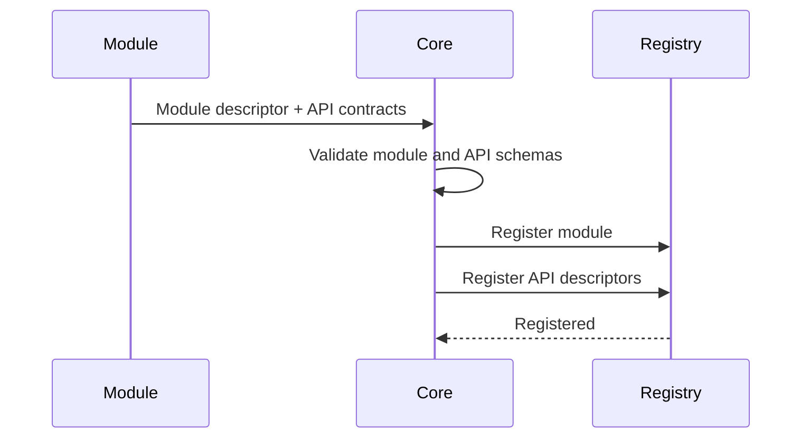

# Manafield Module Protocol

> 이 문서는 초안입니다. 아직 안정화된 규격이 아닙니다.
>
> **한국어 문서를 기준 문서로 우선합니다.**  
> 영문판과 내용이 다를 경우 이 한국어판을 우선합니다.

## 1. 원칙

Manafield Module은 언어에 독립적인 Protocol을 통해 Core와 통신합니다.

> **The protocol is the contract.**

Module은 Manafield Core 코드를 import하거나 필수 SDK를 사용할 필요가 없어야 합니다.

언어별 SDK는 편의를 위해 제공할 수 있지만 선택 사항이어야 합니다.

## 2. 초기 Transport

초기 Protocol은 기본적인 제어와 탐색을 위해 HTTP를 사용하는 방향으로 시작합니다.

필요해질 경우 WebSocket 또는 다른 Message/Event Transport를 추가할 수 있습니다.

## 3. 최소 Endpoint

초기 실험 단계에서는 다음과 같은 Endpoint를 고려합니다.

```http
GET /manafield/health
GET /manafield/info

GET /manafield/settings/schema
GET /manafield/settings
PUT /manafield/settings
```

위 Route는 예시이며 아직 확정된 명세가 아닙니다.

## 4. Module 정보

예시:

```json
{
  "id": "example",
  "name": "Example Module",
  "version": "0.1.0",
  "apiVersion": "v1",
  "capabilities": [
    "example.read"
  ]
}
```

Info endpoint는 다음과 같은 정보를 제공할 수 있습니다.

- identity
- Module version
- 지원하는 Manafield Protocol version
- capabilities
- 선택적인 Web contribution metadata

## 5. API 자동 인식

Module은 자신의 기능뿐 아니라 **외부에 제공하는 API의 형태**를 Core에 설명할 수 있어야 합니다.

개발자 관점에서는 다음과 같은 개념으로 볼 수 있습니다.

```text
API<Input, Output>
```

하지만 Core는 외부 Module의 언어별 타입을 직접 알 수 없으므로, 실제 Protocol에서는 입력과 출력을 **언어 독립적인 Schema**로 표현합니다.

예:

```json
{
  "id": "echo",
  "method": "POST",
  "path": "/echo",
  "input": {
    "type": "object",
    "required": ["message"],
    "properties": {
      "message": { "type": "string" }
    }
  },
  "output": {
    "type": "object",
    "required": ["message"],
    "properties": {
      "message": { "type": "string" }
    }
  }
}
```

초기 구현에서는 JSON Schema와 유사한 표현을 사용해 실험합니다.

Module이 등록될 때 Core는 Module descriptor와 API descriptor를 함께 Registry에 저장합니다.



이를 통해 Core와 Web/CLI Client는 Module 내부 구현 언어를 몰라도 다음 정보를 자동으로 인식할 수 있습니다.

- 어떤 API가 존재하는지
- HTTP Method
- Module 내부 Path
- 예상 Input Schema
- 예상 Output Schema
- 향후 필요한 Permission / Capability

초기에는 API 정보를 **탐색 및 검증용 metadata**로 사용합니다. 실제 자동 Proxy/Route 연결은 Registry 구조가 안정화된 뒤 추가합니다.

Module API는 다른 Module 또는 Core route와 충돌하지 않도록 향후 Module ID 기반 namespace를 기본으로 사용하는 방향을 고려합니다.

## 6. Manifest

Module은 설치 또는 등록 전에 Core가 검증할 수 있는 Manifest를 제공할 수 있습니다.

개념 예시:

```yaml
id: example
name: Example Module
version: 0.1.0

manafieldApi: v1
type: module

runtime:
  type: container

container:
  image: ghcr.io/example/example-module:0.1.0
  port: 8080

health:
  method: GET
  path: /manafield/health

web:
  mode: proxy
  route: /example

permissions:
  - example.read
```

Manifest Schema는 아직 확정되지 않았습니다.

## 7. 호환성 목표

향후 Core 구현을 다른 언어 또는 구조로 교체하더라도 동일한 Protocol version을 구현한다면 기존 Module이 계속 동작할 수 있는 구조를 목표로 합니다.

예:

```text
Rust Core v0.x
      ↓ replaced

Go Core vNext

Module Protocol v1 remains stable
      ↓

Existing Modules continue to work
```

이는 현재의 architecture goal이며 아직 호환성을 보장하는 정책은 아닙니다.

## 8. Module Template

Core와 Module Template은 별도 Repository로 관리할 예정입니다.

예:

```text
manafield-module-template-go
manafield-module-template-python
manafield-module-template-node
```

개발자는 Manafield Core 전체를 clone하지 않고 Template Repository에서 시작해 Protocol만 구현할 수 있어야 합니다.

## 9. 보안 방향

Protocol은 권한과 capability를 명시적으로 표현할 수 있어야 합니다.

향후 Module Package는 다음과 같은 정보를 선언할 수 있습니다.

- 요청 권한
- Runtime 요구사항
- 노출 Port
- Storage 요구사항
- Dependency
- Web contribution

정확한 Security Model은 기본 Protocol과 Docker Runtime이 동작한 뒤 설계합니다.
