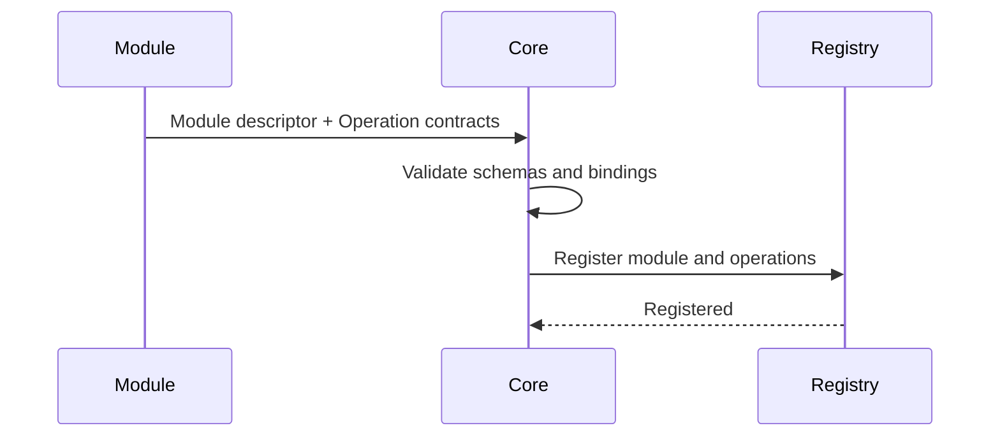

# Manafield Module Protocol

> 이 문서는 초안입니다. 아직 안정화된 규격이 아닙니다.
>
> **한국어 문서를 기준 문서로 우선합니다.**  
> 영문판과 내용이 다를 경우 이 한국어판을 우선합니다.

## 1. 원칙

Manafield Module은 언어에 독립적인 Protocol을 통해 Core와 통신합니다.

> **The protocol is the contract.**

Module은 Manafield Core 코드를 import하거나 필수 SDK를 사용할 필요가 없어야 합니다.

언어별 SDK는 편의를 위해 제공할 수 있지만 선택 사항이어야 합니다.

## 2. Operation, Binding, Codec

Manafield는 Module이 제공하는 호출 가능한 기능을 **Operation**으로 표현합니다.

Operation 자체는 특정 통신 방식에 종속되지 않으며, 실제 호출 방식은 **Binding**으로 분리합니다.

초기 구현에서 지원하는 Binding은 HTTP 하나뿐입니다.

```text
Operation
├─ Input Schema
├─ Output Schema
└─ Binding
   └─ HTTP
      └─ Codec
         ├─ JSON
         └─ MessagePack
```

향후 필요에 따라 gRPC, TCP, WebSocket 또는 다른 방식의 Binding을 추가할 수 있도록 구조를 열어둡니다.

현재 HTTP는 **첫 번째 구현 대상**이지, Manafield Module Protocol 전체를 HTTP로 제한하는 의미가 아닙니다.

Binding은 연결/호출 방식을 나타내고, **Codec은 Payload를 어떤 형식으로 직렬화하는지**를 나타냅니다.

초기 HTTP Binding에서는 다음 Codec을 지원합니다.

- **JSON** — 사람이 읽고 디버깅하기 쉬운 기본 형식
- **MessagePack** — 동일한 구조를 더 compact한 바이너리 형식으로 전송하기 위한 선택지

HTTP에서는 `Accept` / `Content-Type`을 사용해 Codec을 선택하는 방향으로 구현합니다.

```http
Accept: application/json
```

또는:

```http
Accept: application/msgpack
```

`binary`라는 추상 타입 하나를 두기보다, 실제 wire format을 명시적인 Codec으로 선언합니다. 향후 CBOR, Protobuf 등 다른 형식이 필요하면 별도 Codec 또는 Binding 정책으로 확장할 수 있습니다.

## 3. 최소 Endpoint

초기 실험 단계에서는 다음과 같은 Endpoint를 고려합니다.

```http
GET /manafield/health
GET /manafield/info

GET /manafield/settings/schema
GET /manafield/settings
PUT /manafield/settings
```

위 Route는 예시이며 아직 확정된 명세가 아닙니다.

## 4. Module 정보

예시:

```json
{
  "id": "example",
  "name": "Example Module",
  "version": "0.1.0",
  "apiVersion": "v1",
  "capabilities": [
    "example.read"
  ]
}
```

Info endpoint는 다음과 같은 정보를 제공할 수 있습니다.

- identity
- Module version
- 지원하는 Manafield Protocol version
- capabilities
- 선택적인 Web contribution metadata

## 5. Operation 자동 인식

Module은 자신의 기능을 **Operation Contract** 목록으로 Core에 설명할 수 있어야 합니다.

개발자 관점에서는 다음과 같이 생각할 수 있습니다.

```text
Operation<Input, Output>
```

Core는 외부 Module의 언어별 타입을 직접 알 수 없으므로 Input과 Output은 **언어 독립적인 Schema**로 표현합니다.

Operation이 HTTP로 제공되는 경우 HTTP 정보는 Operation 자체가 아니라 Binding에 들어갑니다.

예:

```json
{
  "id": "echo",
  "input": {
    "type": "object",
    "required": ["message"],
    "properties": {
      "message": { "type": "string" }
    }
  },
  "output": {
    "type": "object",
    "required": ["message"],
    "properties": {
      "message": { "type": "string" }
    }
  },
  "binding": {
    "type": "http",
    "method": "POST",
    "path": "/echo",
    "codecs": ["json", "messagepack"]
  }
}
```

초기 Rust 모델은 다음 개념을 따릅니다.

```rust
struct OperationContract {
    id: String,
    input: Option<Value>,
    output: Option<Value>,
    binding: OperationBinding,
}

enum OperationBinding {
    Http {
        method: HttpMethod,
        path: String,
        codecs: Vec<PayloadCodec>,
    },
}
```

현재 `OperationBinding`에는 HTTP만 존재합니다. 다른 통신 방식을 실제로 지원하게 될 때 새로운 variant를 추가합니다.

초기 `PayloadCodec`은 `Json`과 `MessagePack`을 제공합니다. 같은 Rust 자료형을 Serde를 통해 두 형식으로 직렬화할 수 있도록 하며, Module은 자신이 지원하는 Codec 목록을 Binding metadata로 광고할 수 있습니다.

Module이 등록될 때 Core는 Module descriptor와 Operation contracts를 함께 Registry에 저장합니다.



이를 통해 Core와 Web/CLI Client는 Module 내부 구현 언어를 몰라도 다음 정보를 탐색할 수 있습니다.

- 어떤 Operation이 존재하는지
- 예상 Input Schema
- 예상 Output Schema
- 어떤 Binding으로 호출되는지
- HTTP Binding이라면 Method와 Path
- 해당 Binding이 지원하는 Codec
- 향후 필요한 Permission / Capability

초기에는 Operation 정보를 **탐색 및 검증용 metadata**로 사용합니다. 실제 자동 Proxy/Route 연결은 Registry 구조가 안정화된 뒤 추가합니다.

현재 Core의 Module discovery 응답은 실험적으로 HTTP content negotiation을 지원합니다. 기본 응답은 JSON이며, `Accept: application/msgpack`을 보내면 MessagePack 바이너리로 응답합니다.

## 6. Manifest

Module은 설치 또는 등록 전에 Core가 검증할 수 있는 Manifest를 제공할 수 있습니다.

개념 예시:

```yaml
id: example
name: Example Module
version: 0.1.0

manafieldApi: v1
type: module

runtime:
  type: container

container:
  image: ghcr.io/example/example-module:0.1.0
  port: 8080

health:
  method: GET
  path: /manafield/health

web:
  mode: proxy
  route: /example

permissions:
  - example.read
```

Manifest Schema는 아직 확정되지 않았습니다.

### 현재 개발용 Module discovery

현재 Core는 `MANAFIELD_MODULES_DIR` 환경변수로 Module 탐색 루트 디렉터리를 지정할 수 있습니다. 지정하지 않으면 기본값은 `modules`입니다.

Core는 해당 디렉터리 아래에서 `manafield.module.json` 파일을 재귀적으로 탐색합니다.

```text
MANAFIELD_MODULES_DIR
        ↓
manafield.module.json 탐색
        ↓
JSON → ModuleDescriptor
        ↓
Registry validation
        ↓
ModuleRegistry
```

현재 검증 규칙에는 다음이 포함됩니다.

- Module ID / 이름 / 버전은 비어 있을 수 없음
- 한 Module 안에서 Operation ID는 중복될 수 없음
- HTTP Path는 `/`로 시작해야 함
- HTTP Operation은 최소 하나 이상의 Codec을 선언해야 함
- 동일 Module ID를 중복 등록할 수 없음

잘못된 Manifest는 조용히 무시하지 않고 Core 시작을 실패시킵니다.

Repository의 `examples/modules/sample/manafield.module.json`은 현재 구현을 검증하기 위한 예시입니다.

이 파일 형식은 현재 개발 중인 Descriptor/Manifest 형태이며, 향후 Runtime, Permission, Dependency 등의 설치 metadata가 합쳐지면서 변경될 수 있습니다.

## 7. 호환성 목표

향후 Core 구현을 다른 언어 또는 구조로 교체하더라도 동일한 Protocol version을 구현한다면 기존 Module이 계속 동작할 수 있는 구조를 목표로 합니다.

예:

```text
Rust Core v0.x
      ↓ replaced

Go Core vNext

Module Protocol v1 remains stable
      ↓

Existing Modules continue to work
```

이는 현재의 architecture goal이며 아직 호환성을 보장하는 정책은 아닙니다.

## 8. Module Template

Core와 Module Template은 별도 Repository로 관리할 예정입니다.

예:

```text
manafield-module-template-go
manafield-module-template-python
manafield-module-template-node
```

개발자는 Manafield Core 전체를 clone하지 않고 Template Repository에서 시작해 Protocol만 구현할 수 있어야 합니다.

## 9. 보안 방향

Protocol은 권한과 capability를 명시적으로 표현할 수 있어야 합니다.

향후 Module Package는 다음과 같은 정보를 선언할 수 있습니다.

- 요청 권한
- Runtime 요구사항
- 노출 Port
- Storage 요구사항
- Dependency
- Web contribution

정확한 Security Model은 기본 Protocol과 Docker Runtime이 동작한 뒤 설계합니다.
