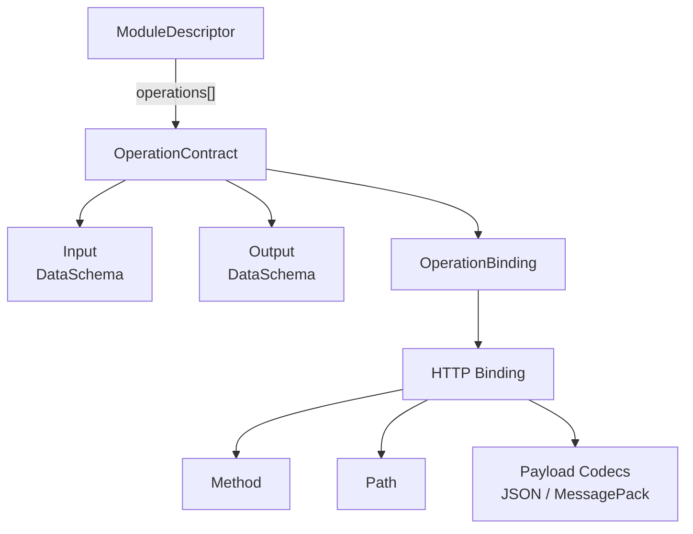
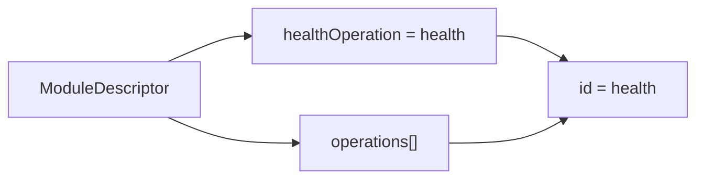
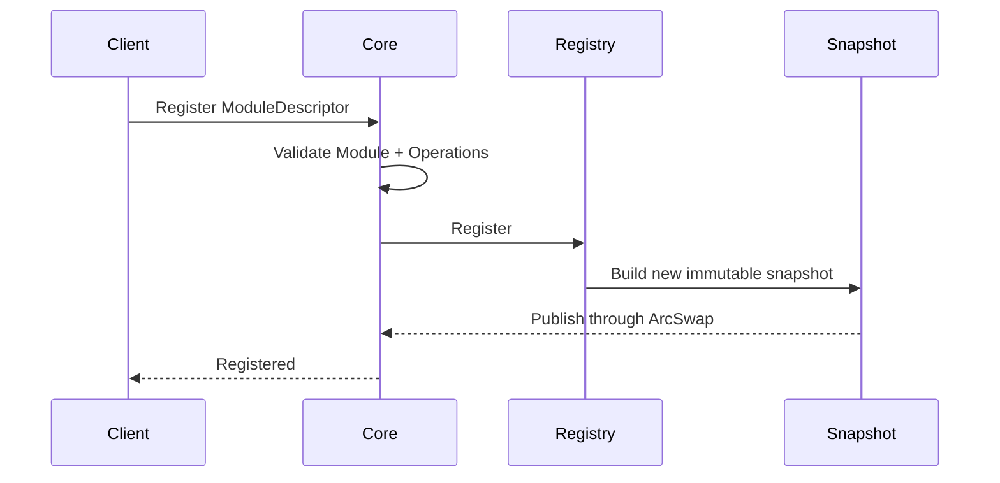

# Manafield Operation

> 이 문서는 Manafield Module이 제공하는 **Operation Contract**의 현재 설계를 설명합니다.  
> Manafield는 아직 **pre-alpha / design stage**이며 세부 규격은 변경될 수 있습니다.
>
> **한국어 문서를 기준 문서로 우선합니다.**  
> 영문판과 내용이 다를 경우 이 한국어판을 우선합니다.

## 1. Operation이란?

Manafield에서 **Operation**은 Module이 외부에 제공하는 호출 가능한 기능의 계약입니다.

Operation은 "어떻게 구현되었는가"보다 다음을 설명합니다.

- 어떤 기능인지 식별하는 ID
- 어떤 입력을 받는지
- 어떤 출력을 반환하는지
- 어떤 방식으로 호출할 수 있는지

개념적으로는 다음과 같이 볼 수 있습니다.

```text
Operation<Input, Output>
```

Module의 내부 구현 언어는 Operation Contract에 포함되지 않습니다.

Python, Go, Node.js, Java, Rust 등 어떤 환경에서 구현하더라도 동일한 Contract를 표현할 수 있는 구조를 목표로 합니다.

## 2. 현재 구조

현재 Rust 모델은 다음 개념을 따릅니다.

```rust
struct OperationContract {
    id: String,
    input: Option<DataSchema>,
    output: Option<DataSchema>,
    binding: OperationBinding,
}
```

전체 구조는 다음과 같습니다.



현재 Operation Contract는 Module Registry에 저장되어 **탐색과 검증을 위한 계약 정보**로 사용됩니다.

실제 Operation 자동 Proxy / 호출 기능은 아직 구현 범위에 포함되지 않았습니다.

## 3. Input / Output

Operation의 Input과 Output은 언어별 타입을 직접 저장하지 않고 **DataSchema**로 표현합니다.

입력이나 출력이 없는 경우 `null`로 표현할 수 있습니다.

예:

```json
{
  "id": "echo",
  "input": {
    "type": "object",
    "required": ["message"],
    "properties": {
      "message": {
        "type": "string"
      }
    }
  },
  "output": {
    "type": "object",
    "required": ["message"],
    "properties": {
      "message": {
        "type": "string"
      }
    }
  }
}
```

현재 지원하는 DataSchema 타입은 다음과 같습니다.

| Type | 의미 |
| --- | --- |
| `string` | 문자열 |
| `integer` | 정수 |
| `number` | 숫자 |
| `boolean` | Boolean |
| `array` | 동일 Schema를 원소로 가지는 배열 |
| `object` | 이름별 Property를 가지는 객체 |

`array`와 `object`는 다른 DataSchema를 재귀적으로 포함할 수 있습니다.

예:

```json
{
  "type": "object",
  "required": ["name", "tags"],
  "properties": {
    "name": {
      "type": "string"
    },
    "tags": {
      "type": "array",
      "items": {
        "type": "string"
      }
    }
  }
}
```

Core는 Object Schema의 `required` 항목이 실제 `properties`에 존재하는지와 중복 여부를 검증합니다.

## 4. Binding

Operation 자체는 특정 통신 방식에 종속되지 않습니다.

실제 호출 방법은 **OperationBinding**이 담당합니다.

현재 구현된 Binding은 HTTP 하나뿐입니다.

```rust
enum OperationBinding {
    Http {
        method: HttpMethod,
        path: String,
        codecs: Vec<PayloadCodec>,
    },
}
```

현재 HTTP Method는 다음을 지원합니다.

- `GET`
- `POST`

향후 실제 필요가 생기면 다른 HTTP Method 또는 gRPC, TCP, WebSocket 등의 Binding을 별도 variant로 확장할 수 있습니다.

즉 HTTP는 현재의 첫 번째 Binding일 뿐, Operation 모델 자체를 HTTP 전용으로 제한하지 않습니다.

## 5. Codec

Binding은 **어떻게 호출하는가**를 설명하고, Codec은 **Payload를 어떤 wire format으로 표현하는가**를 설명합니다.

현재 HTTP Binding은 다음 Codec을 사용할 수 있습니다.

- `json`
- `messagepack`

예:

```json
{
  "binding": {
    "type": "http",
    "method": "POST",
    "path": "/echo",
    "codecs": [
      "json",
      "messagepack"
    ]
  }
}
```

HTTP에서는 다음 헤더를 이용해 Codec을 선택합니다.

```http
Content-Type: application/json
Accept: application/json
```

또는:

```http
Content-Type: application/msgpack
Accept: application/msgpack
```

`binary`라는 추상적인 한 종류를 두는 대신, 실제 직렬화 형식을 명시적인 Codec으로 선언합니다.

## 6. Health Operation

Module은 선택적으로 하나의 Operation을 Health check 용도로 지정할 수 있습니다.

```json
{
  "healthOperation": "health"
}
```

이는 Health check 정보를 별도로 복제하는 것이 아니라, 기존 `operations[]` 안의 Operation ID를 가리키는 참조입니다.



현재 Core는 다음을 검증합니다.

- `healthOperation`이 지정되면 해당 ID의 Operation이 실제로 존재해야 합니다.
- Health Operation은 별도 입력 없이 호출할 수 있도록 `input`이 `null`이어야 합니다.

Health Operation의 Output Schema는 현재 고정하지 않습니다.

## 7. 전체 예시

```json
{
  "id": "sample",
  "name": "Sample Module",
  "version": "0.0.1",
  "healthOperation": "health",
  "operations": [
    {
      "id": "health",
      "input": null,
      "output": {
        "type": "object",
        "required": ["status"],
        "properties": {
          "status": {
            "type": "string"
          }
        }
      },
      "binding": {
        "type": "http",
        "method": "GET",
        "path": "/manafield/health",
        "codecs": [
          "json",
          "messagepack"
        ]
      }
    },
    {
      "id": "echo",
      "input": {
        "type": "object",
        "required": ["message"],
        "properties": {
          "message": {
            "type": "string"
          }
        }
      },
      "output": {
        "type": "object",
        "required": ["message"],
        "properties": {
          "message": {
            "type": "string"
          }
        }
      },
      "binding": {
        "type": "http",
        "method": "POST",
        "path": "/echo",
        "codecs": [
          "json",
          "messagepack"
        ]
      }
    }
  ]
}
```

## 8. Registry와의 관계

Module을 Registry에 등록하면 Operation Contract도 Module Descriptor의 일부로 함께 등록됩니다.



Reader는 mutable Registry를 직접 조회하지 않고 현재 `RegistrySnapshot`에서 Module과 Operation 정보를 읽습니다.

## 9. 현재 Validation 규칙

현재 Operation과 관련해 Core가 검사하는 규칙은 다음과 같습니다.

- Operation ID는 비어 있을 수 없음
- 한 Module 안에서 Operation ID는 중복될 수 없음
- Input / Output DataSchema는 유효해야 함
- HTTP Path는 `/`로 시작해야 함
- HTTP Operation은 최소 하나 이상의 Codec을 선언해야 함
- `healthOperation` 참조는 실제 Operation을 가리켜야 함
- Health Operation은 Input을 요구할 수 없음

이 규칙들은 현재 구현 기준이며, Protocol 안정화 과정에서 변경될 수 있습니다.
